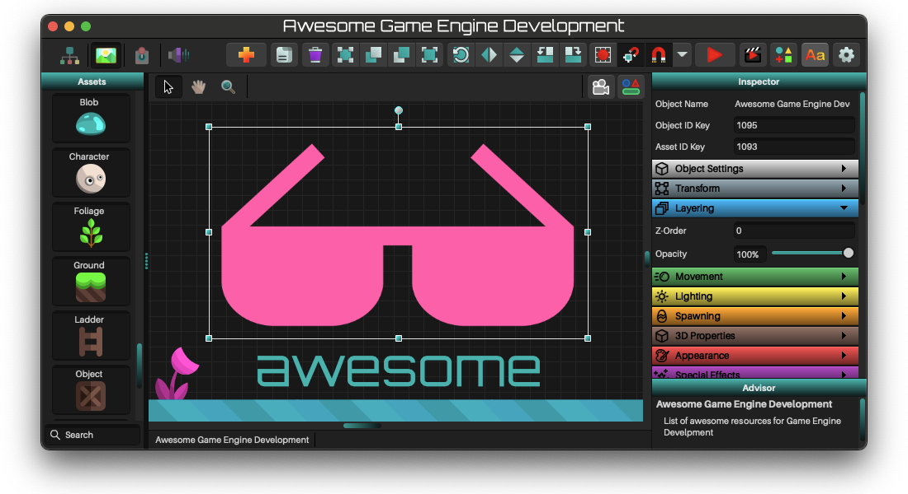

    

# Awesome Game Engine Development 

> Awesome list of articles, assets, libraries, and tools for Game Engine Development.

Specifically, this list is geared toward development of high-level, fully featured game engines (e.g. Godot / Unity). This would include things typically not found in low-level game engines, app / game frameworks, or graphics libraries (e.g. MonoGame / SDL). Most importantly of which would be a visual scene editor, but also capabilities such as scripting support, physics integration, asset management, special effects, etc.

This list currently favors (but is not limited to) programming game engines in the following languages: C, C++, C#, Haxe, JavaScript.

 

<ins> **License Legend** </ins>
- Open Source Software
    - ⭐ - [Public Domain License](https://en.wikipedia.org/wiki/Public-domain-equivalent_license) ([CC0](https://creativecommons.org/publicdomain/zero/1.0/), [BOLA](https://blitiri.com.ar/p/bola/), [WTFPL](https://en.wikipedia.org/wiki/WTFPL), [Unlicense](https://en.wikipedia.org/wiki/Unlicense), etc.)
    - 🎉 - [Permissive License](https://en.wikipedia.org/wiki/Permissive_software_license) ([MIT / Expat](https://en.wikipedia.org/wiki/MIT_License), [BSD](https://en.wikipedia.org/wiki/BSD_licenses), [ZLIB / LIBPNG](https://en.wikipedia.org/wiki/Zlib_License), [ISC](https://en.wikipedia.org/wiki/ISC_license), [Apache](https://en.wikipedia.org/wiki/Apache_License), [Boost](https://en.wikipedia.org/wiki/Boost_(C%2B%2B_libraries)#License) etc.)
    - 🔒 - [Copyleft License](https://en.wikipedia.org/wiki/Copyleft) ([CC](https://en.wikipedia.org/wiki/Creative_Commons_license), [GPL](https://en.wikipedia.org/wiki/GNU_General_Public_License) / [LGPL](https://en.wikipedia.org/wiki/GNU_Lesser_General_Public_License), [MPL](https://en.wikipedia.org/wiki/Mozilla_Public_License), etc.)
- Asset / Service / Tool
    - 🆓 - Free
    - 💰 - Paid
    - 💸 - Partially Free
- Other
    - 📚 - Article, Blog, Collection, List, Tutorial(s)
    - 🌎 - Website
- :octocat: - Link to Repository. Click on it to see Source Code!
- 🔥 - Hot, Amazing Resource!

 
 

## Contents
- [Game Engines](#game-engines)
    - [Popular](#popular)
    - [AAA](#aaa)
    - [Commercial](#commercial)
    - [Specialty](#specialty)
- [Learning](#learning)
    - [Computer Graphics](#computer-graphics)
        - [DirectX](#graphics-api-directx) | [Metal](#graphics-api-metal) | [OpenGL](#graphics-api-opengl) | [Vulkan](#graphics-api-vulkan) | [WebGL](#graphics-api-webgl) | [WebGPU](#graphics-api-webgpu) | [XNA](#platform-xna) 
    - [Engine Development](#engine-development)
    - [Game Development](#game-development)
    - [Graphical User Interface](#graphical-user-interface)
    - [Programming](#programming)
- [Libraries](#libraries)
    - [BASIC](#basic)
    - [C](#c)
    - [C++](#c-1)
    - [C#](#c-2)
    - [Dart](#dart)
    - [Go](#go)
    - [Haxe](#haxe)
    - [Java](#java)
    - [JavaScript](#javascript)
    - [Kotlin](#kotlin)
    - [Python](#python)
    - [Ruby](#ruby)
    - [Rust](#rust)
    - [Zig](#zig)
- [Open Source Games](#open-source-games)
    - [C](#c-3)
    - [C++](#c-4)
    - [Java](#java-1)
- [Specialty Topics](#specialty-topics)
    - [AI / Pathfinding](#ai--pathfinding)
    - [Animation Info](#animation-info)
    - [Color Manipulation](#color-manipulation)
    - [Entity Component Systems](#entity-component-systems)
    - [Fluid / Smoke](#fluid--smoke)
    - [Geometry](#geometry)
        - [Algorithms](#algorithms) | [CSG](#csg-constructive-solid-geometry) | [Meshes](#meshes) | [Smoothing](#smoothing)
    - [Lighting / Shadows](#lighting--shadows)
        - [Lighting](#lighting-2d) | [Shadows](#shadows-2d) | [Volumetric](#volumetric)
    - [Machine Learning](#machine-learning)
        - [Imaging](#imaging) | [Modeling](#modeling)
    - [Network](#network)
    - [Particles](#particles)
    - [Physics](#physics)
        - [Platformer](#platformer) | [Ropes / Chains](#ropes--chains) | [Soft Body](#soft-body) | [Verlet](#verlet-physics) | [Water / Buoyancy](#water--buoyancy)
    - [Scripting](#scripting)
    - [Shaders](#shaders)
        - [Bloom](#bloom) | [Displacement](#displacement) | [Fire](#fire) | [Noise](#noise) | [Outlines](#outlines) | [Pixelation](#pixelation) | [Upscaling](#upscaling) | [Water](#water--refraction) | [Wireframe](#wireframe)
    - [Signed Distance Fields](#signed-distance-fields)
    - [Tiling](#tiling)
- [Tools / Software](#tools--software)
    - [2D Game Dev](#2d-game-dev)
    - [Animation Software](#animation-software)
    - [Audio Tools](#audio-tools)
    - [Color / Palettes](#color--palettes)
    - [Image Editors](#image-editors)
    - [Level Editors](#level-editors)
    - [Materials / Textures](#materials--textures)
    - [Modeling Tools](#modeling-tools)
    - [Particle Tools](#particle-tools)
    - [Pixel Art](#pixel-art)
    - [Vector Editors](#vector-editors)
    - [Voxel](#voxel)
- [Video Game Assets](#video-game-assets)
    - [Audio Assets](#audio-assets)
    - [Graphic Assets](#graphic-assets)
    - [Material Assets](#material-assets)
    - [Model Assets](#model-assets)

 
 

## Game Engines
_Production game engines to tinker with, explore, learn and inspire._

- ### Popular
    - 🎉 [Godot](https://godotengine.org) [:octocat:](https://github.com/godotengine/godot#readme) - 🔥 Feature-packed, open source engine. Excellent! [[Awesome Godot](https://github.com/godotengine/awesome-godot#readme)]
    - 💸 [Unity](https://unity.com) - Biggest name in game engines, industry standard. [[Awesome Unity](https://github.com/RyanNielson/awesome-unity)]
    - 💸 [Unreal Engine](https://www.unrealengine.com) - AAA quality, insane feature set, photoreal visuals. [[Awesome UE4](https://github.com/insthync/awesome-ue4#readme)]

- ### Awesome Collections
    - 📚 [CoolEngines](https://github.com/JohnClarking/CoolEngines) - Awesome list for open source graphic & game engine.
    - 📚 [Wikipedia: List of Game Engines](https://en.wikipedia.org/wiki/List_of_game_engines) - List of game engines along with their platforms and licenses.

- ### AAA
    - 🎉 [Amazon Lumberyard](https://aws.amazon.com/lumberyard/) [:octocat:](https://github.com/aws/lumberyard) - (forked from CRYENGINE) AAA engine integrated with AWS and Twitch.
    - 💰 [C4 Engine](http://c4engine.com) - Modern console engine.
    - 💸 [CRYENGINE](https://www.cryengine.com) [:octocat:](https://github.com/CRYTEK/CRYENGINE) - Powerful real-time game development platform created by Crytek.
    - 🆓 [Evergine](https://evergine.com) - (previously Wave Engine) High-quality 3D and 2D solutions. [[Projects/Samples](https://github.com/EvergineTeam/Samples)]
    - 💸 [Flax Engine](https://flaxengine.com) [:octocat:](https://github.com/FlaxEngine/FlaxEngine) - Modern 3D game engine written in C++ and C#.
    - 💰 [Frostbite](https://www.ea.com/frostbite) - (by Electronic Arts) Cutting-Edge Games and Experiences.
    - 💰 [Gamebryo](http://www.gamebryo.com) - Complete toolset, flexible workflow, rapid prototyping.
    - 🎉 [O3DE](https://docs.o3de.org) [:octocat:](https://github.com/o3de/o3de/) - (successor to Lumberyard) Multi-platform AAA engine. Cinema-quality 3D.
    - 💰 [Snowdrop Engine](https://www.massive.se/project/snowdrop-engine/) - (by Massive Entertainment) Enabling small teams to create AAA games.
    - 💸 [Unigine](https://unigine.com) - Real-time 3D engine. Photorealistic graphics, large virtual worlds, C++ and C# API.

- ### Commercial
    - 💰 [AppGameKit Studio](https://www.appgamekit.com/studio) - Easy, quick and powerful programming.
    - 💸 [Buildbox](https://www.buildbox.com) - Create 3D & 2D video games without coding.
    - 💸 [Construct](https://www.construct.net/) - Browser based drag and drop game builder. [[Awesome Construct](https://github.com/ConstructCommunity/awesome-construct#readme)]
    - 💸 [Felgo](https://felgo.com/games) - Build Cross-Platform 2D Games in Days. Based on the Qt framework.
    - 💸 [GameMaker Studio](https://www.yoyogames.com/en/gamemaker) - (by YoYo Games) 2D Game Development Environment with large following.
    - 💸 [GameSalad](https://gamesalad.com) - Sophisticated visual programming interface.
    - 💸 [MANU](https://manu.co) - Unique animation system helps you create games without coding.
    - 💸 [NeoAxis](https://www.neoaxis.com) [:octocat:](https://github.com/NeoAxis/NeoAxisEngine) - Versatile real-time platform for making 2D / 3D games and apps.
    - 💰 [Phaser Editor 2D](https://phasereditor2d.com) [:octocat:](https://github.com/PhaserEditor2D/PhaserEditor2D-v3) - Commercial, web based editor for Phaser.
    - 💸 [PlayCanvas](https://playcanvas.com) [:octocat:](https://github.com/playcanvas/engine) - Popular (Flappy Bird), game engine built on WebGL. [[Awesome PlayCanvas](https://github.com/playcanvas/awesome-playcanvas#readme)]
    - 💸 [ShiVa](https://shiva-engine.com) - 3D game and application development suite.
    - 💸 [Simulation Starter Kit](https://benmorris.itch.io/plugin-based-scene-editor) - Create interactive 3D apps across a range of platforms. [[Developer Website](http://fireflytech.org)]
    - 💸 [Stencyl](https://www.stencyl.com/) [:octocat:](https://github.com/Stencyl/stencyl-engine) - Quick and easy game making. Visual scripting similar to [Scratch](https://scratch.mit.edu).

- ### Specialty
    - 💰 [3dSen](https://geod.itch.io/3dnes) - NES emulator that lets you play NES games in 3D. [[Developer Website](http://www.geodstudio.net)]
    - 💸 [DopeFish](https://subpixel-studios.itch.io/dopefish) - Full GML Doom/Heretic map loading system for GameMaker Studio.
    - 🎉 [GB Studio](https://www.gbstudio.dev) [:octocat:](https://github.com/chrismaltby/gb-studio) - Retro adventure game creator for Game Boy available for Mac, Linux and Windows.
    - 🔒 [HARFANG 3D](https://github.com/harfang3d/harfang3d) - 3D visualization library for industry professionals, usable in C++, Python, Lua, Go.
    - 💰 [Platforming Engine](https://robvansaaze.itch.io/platforming-engine) - Everything you need to create your own platformer in GameMaker.
    - 💰 [RPG Maker](https://www.rpgmakerweb.com) - Create an original role-playing game without any specialized knowledge.
    - 🔒 [Twine](https://twinery.org) [:octocat:](https://github.com/klembot/twinejs) - Tool for telling interactive, nonlinear stories.

 
 

## Learning
_Info on topics necessary for designing and developing game engines._

- ### Computer Graphics
    - #### Awesome Collections
        - 📚 [Awesome Graphics Libraries](https://github.com/jslee02/awesome-graphics-libraries#readme) - Awesome curated list of 3D graphics libraries and resources.
    - #### Blog Articles
        - 📚 [Comparison of Modern Graphics APIs](https://alain.xyz/blog/comparison-of-modern-graphics-apis) - Modern graphics APIs vs older APIs.
    - #### Books
        - 📚 [GPU Gems](https://developer.nvidia.com/gpugems/gpugems/contributors) - Programming techniques, tips, and tricks for real-time graphics.
        - 📚 [GPU Gems 2](https://developer.nvidia.com/gpugems/gpugems2/copyright) - Programming techniques for high-performance graphics.
        - 📚 [GPU Gems 3](https://developer.nvidia.com/gpugems/gpugems3/contributors) - Collection of state-of-the-art GPU programming examples hosted by NVIDIA.
        - 📚 [Physically Based Rendering](https://www.pbrt.org) - The Academy Award winning authority on PBR.
    - #### Education Portals
        - 📚 [Lighthouse3d.com](http://www.lighthouse3d.com/tutorials/) - Collection of tutorials on OpenGL, GLSL and other graphics topics.
        - 📚 [Scratchapixel](https://www.scratchapixel.com) - In depth coverage of many computer graphics topics.
    - #### Graphics API: DirectX
        - 🌎 [DirectX](https://docs.microsoft.com/en-us/windows/win32/directx) - Microsoft API used to create 2D / 3D games and apps. [[Sample Code](https://github.com/microsoft/DirectX-Graphics-Samples) | [Blog](https://devblogs.microsoft.com/directx/)]
        - 📚 [DirectXTutorial.com](http://www.directxtutorial.com/default.aspx) - Older resource with lots of tutorials on DirectX versions 9 & 11.
    - #### Graphics API: Metal
        - 🌎 [Metal](https://developer.apple.com/metal/) - Apple API for developing 3D apps on Apple platforms. [[Sample Code](https://developer.apple.com/metal/sample-code/)]
        - 📚 [Metal Tutorial](https://www.raywenderlich.com/7475-metal-tutorial-getting-started) - Learn how to get started with Apple's 3D graphics API at RayWenderlich.com.
    - #### Graphics API: OpenGL
        - 📚 [LearnOpenGL](https://learnopengl.com) - 🔥 Incredible resource! In depth tutorials for modern graphics programming.
        - 🌎 [OpenGL](https://www.opengl.org/) - The industry's foundation for high performance graphics.
        - 📚 [OpenGL Tutorial](https://www.opengl-tutorial.org) - Collection of OpenGL tutorials with source code examples.
    - #### Graphics API: Vulkan
        - 🌎 [Vulkan](https://www.vulkan.org) - Modern cross-platform graphics API. [[Sample Code](https://github.com/khronosGroup/Vulkan-samples)]
        - 📚 [Vulkan Tutorial](https://vulkan-tutorial.com) - Teaches the basics of using Vulkan graphics and compute API.
    - #### Graphics API: WebGL
        - 🌎 [WebGL](https://www.khronos.org/webgl/) [:octocat:](https://github.com/KhronosGroup/WebGL) - Open web standard 3D graphics API.
        - 📚 [WebGL Fundamentals](https://webglfundamentals.org) - 🔥 Full understanding of what WebGL really is and how it works.
        - 📚 [WebGL 2 Fundamentals](https://webgl2fundamentals.org) - Updated to use the WebGL2 standard.
        - 📚 [WebGL Tutorial](https://developer.mozilla.org/en-US/docs/Web/API/WebGL_API/Tutorial) - How to use the canvas element to draw WebGL graphics.
    - #### Graphics API: WebGPU
        - 🌎 [Dawn](https://dawn.googlesource.com/dawn) - Google's open-source and cross-platform implementation of the WebGPU standard.
        - 🌎 [WebGPU](https://github.com/gpuweb/gpuweb/wiki/Implementation-Status) [:octocat:](https://github.com/gpuweb/gpuweb) - Next generation web 3D graphics API.
        - 🌎 [WebGPU Demos](https://webkit.org/demos/webgpu/) - Apple's collection of simple WebGPU examples.
    - #### Platform: XNA
        - 📚 [RB Whitaker's Wiki](http://rbwhitaker.wikidot.com/) - C# learning resource, [XNA Tutorials](http://rbwhitaker.wikidot.com/xna-tutorials), [MonoGame Tutorials](http://rbwhitaker.wikidot.com/monogame-tutorials), and more.
        - 📚 [XNA Game Studio Archive](https://github.com/SimonDarksideJ/XNAGameStudio) - 🔥 Required visit for MonoGame / FNA / [XNA](https://en.wikipedia.org/wiki/Microsoft_XNA) developers.
    - #### Shader
        - _see [Specialty Topic: Shaders](#shaders)_

- ### Engine Development
    - #### Blog Articles
        - 📚 [3D Game Engine Programming](https://www.3dgep.com) - Helping you build your dream game engine.
        - 📚 [How to Become a Game Engine Developer](https://www.haroldserrano.com/blog/how-to-become-a-game-engine-developer) - Starting point on game engine development.
    - #### Books
        - 📚 [Game Engine Architecture](https://www.gameenginebook.com) - Theory and practice of game engine development.

- ### Game Development
    - #### Awesome Collections
        - 📚 [Awesome Gamedev](https://github.com/Calinou/awesome-gamedev#readme) - Collection of free software and free resources for making games.
        - 📚 [GameDev-Resources](https://github.com/Kavex/GameDev-Resources) - Wonderful list of Game Development resources.
        - 📚 [Magictools](https://github.com/ellisonleao/magictools#readme) - List of Game Development resources to make magic happen.
        - 🌎 [Open Source Libraries](https://opensourcelibs.com) - Massive collection of the world's best open source software.
    - #### Books
        - 📚 [Art of Game Design](https://www.amazon.com/Art-Game-Design-Book-Lenses/dp/0123694965) - Teaches game design in an accessible manner.
        - 📚 [Game Programming Patterns](https://gameprogrammingpatterns.com) - Patterns found in games that make code easier to understand.
    - #### Developer Portals
        - 🌎 [GameDev.net](https://www.gamedev.net/) - Game dev forums, tutorials, blogs, projects, portfolios, and news.
        - 🌎 [GameFromScratch.com](https://gamefromscratch.com) - Game development news, tutorials and so much more.
        - 🌎 [itch.io](https://itch.io) - Game dev resources and platform to showcase / promote / buy & sell games.

- ### Graphical User Interface
    - 📚 [List of Widget Toolkits](https://en.wikipedia.org/wiki/List_of_widget_toolkits) - GUI frameworks across all platforms and languages.

- ### Programming
    - 📚 [Big-O Cheat Sheet](https://www.bigocheatsheet.com) - Big-O complexities of algorithms used in computer science.
    - 🌎 [Deadlock Empire](https://deadlockempire.github.io/#menu) - Interactive tutorial to master threads and concurrency.
    - 📚 [Every Programmer Should Know](https://github.com/mtdvio/every-programmer-should-know) - Technical things every developer should know.
    - 📚 [Games of Coding](https://github.com/michelpereira/awesome-games-of-coding#readme) - Games that teach you a programming language.
    - 🌎 [Geeks for Geeks](https://www.geeksforgeeks.org) - Tutorials, articles, courses, coding competitions, jobs and more.
    - 📚 [Learn to Program](https://github.com/karlhorky/learn-to-program#readme) - Educational resources to learn to program.
    - 📚 [TIOBE Index](https://www.tiobe.com/tiobe-index/) - Popularity of programming languages, updated once a month.

 
 

## Libraries
_Language specific game engine development libraries / frameworks / code._

- ### BASIC
    - #### - General -
        - 🎉 [Basics Page](http://basic.mindteq.com/index.php?i=popular) - Comprehensive list of BASIC languages.
    - #### BASIC: App Framework
        - 💰 [Basic for Qt](https://www.q7basic.org/index.html) - (formerly Q7Basic) BASIC language and environment built on top of Qt.
        - 🎉 [QB64](https://qb64.org) [:octocat:](https://github.com/QB64Team/qb64) - Modern BASIC + OpenGL language, retains QB4.5 / QBasic compatibility.
        - 📚 [Visual Basic](https://docs.microsoft.com/en-us/dotnet/visual-basic/) - Object-oriented language developed by Microsoft.
    - #### BASIC: Game Framework
        - 🎉 [Dark Basic](https://www.thegamecreators.com/product/dark-basic-pro-open-source) [:octocat:](https://github.com/TheGameCreators/Dark-Basic-Pro) - BASIC programming language for creating Windows apps and games.

- ### C
    - #### - General -
        - 📚 [Learn C Programming](https://www.programiz.com/c-programming) - Excellent C tutorials that will guide you to learn C programming.
    - #### Awesome Libraries
        - ⭐ [Cute Headers](https://github.com/RandyGaul/cute_headers) - Single-file libraries primarily used for games by [Randy Gaul](https://github.com/RandyGaul).
        - ⭐ [Libs](https://github.com/mattiasgustavsson/libs) - Single-file public domain libraries for C/C++ by [Mattias Gustavsson](https://github.com/mattiasgustavsson).
        - ⭐ [Pico Headers](https://github.com/empyreanx/pico_headers) - Single-file, cross-platform libraries for game development.
        - 📚 [Single File Libs](https://github.com/nothings/single_file_libs) - Amazing collection of single file C/C++ libraries compiled from many authors.
        - ⭐ [stb](https://github.com/nothings/stb) - 🔥 The amazing stb single-file public domain libraries for C/C++ by [Sean Barrett](https://github.com/nothings).
    - #### C: App Framework
        - 🎉 [Entrypoint](https://github.com/jimon/entrypoint) - Lightweight entry point for games.
        - 🎉 [glfw](https://www.glfw.org) [:octocat:](https://github.com/glfw/glfw) - Cross-platform, simple API for windowing, graphics contexts, input and events.
        - 🎉 [Gunslinger](https://github.com/MrFrenik/gunslinger) - Header-only c99 framework for multimedia apps.
        - 🎉 [RayLib](https://www.raylib.com) [:octocat:](https://github.com/raysan5/raylib) - Simple and easy-to-use library to enjoy 2D / 3D videogame programming.
        - 🎉 [SDL](https://libsdl.org) [:octocat:](https://github.com/libsdl-org/SDL) - 🔥 Low level access to audio, keyboard, mouse, joystick, and graphics hardware.
        - 🎉 [Sokol](https://github.com/floooh/sokol) - 🔥 Single-file libraries for graphics, windowing, file handling, audio and more. Excellent!
    - #### C: Audio
        - ⭐ [Miniaudio](https://miniaud.io) [:octocat:](https://github.com/mackron/miniaudio) - Single file audio playback and capture library written in C.
        - 🎉 [SDL_mixer](https://libsdl.org/projects/SDL_mixer/) [:octocat:](https://github.com/libsdl-org/SDL_mixer) - Audio mixer that supports various file formats for SDL.
        - 🎉 [SoLoud](http://sol.gfxile.net/soloud/) [:octocat:](https://github.com/jarikomppa/soloud) - 🔥 Free, easy, portable audio engine for games.
    - #### C: Cross-Platform
        - 🎉 [Cosmopolitan](https://github.com/jart/cosmopolitan) - Build-once run-anywhere C library.
    - #### C: Entity Component System
        - 🎉 [Flecs](https://github.com/SanderMertens/flecs) - Fast and lightweight entity component system in C99.
    - #### C: File Formats
        - 🎉 [Assimp](https://www.assimp.org) [:octocat:](https://github.com/assimp/assimp) - The Open Asset Importer Library. Loads 40+ 3D file formats.
        - 🎉 [cgltf](https://github.com/jkuhlmann/cgltf) - Single-file glTF 2.0 loader and writer written in C99.
        - ⭐ [dr_libs](https://github.com/mackron/dr_libs) - Single file audio decoding libraries for C/C++.
        - 🎉 [Libspng](https://github.com/randy408/libspng) - Simple, modern libpng alternative.
        - 🎉 [Miniz](https://github.com/richgel999/miniz) - Single C source file drop-in replacement for zlib's most used APIs (libpng and libzip).
        - 🎉 [OBJ GL Loader v2](https://github.com/karolek471/objgl) - Quite fast wavefront OBJ loader for OpenGL.
        - 🎉 [PL_MPEG](https://github.com/phoboslab/pl_mpeg) - Single file C library for decoding MPEG1 Video and MP2 Audio.
        - 🎉 [QOI](https://github.com/phoboslab/qoi) - The “Quite OK Image Format” for fast, lossless image compression.
        - ⭐ [stb_vorbis](https://github.com/nothings/stb/blob/master/stb_vorbis.c) - Ogg Vorbis audio decoder.
    - #### C: File System
        - 🎉 [HexEmbed](https://github.com/codeplea/hexembed) - Small utility to help embed files in C/C++ programs in an easy, cross-platform way.
        - ⭐ [Incbin](https://github.com/graphitemaster/incbin) - Include binary and text files in your C/C++ applications with ease.
        - 🎉 [PhysicsFS](http://icculus.org/physfs/) [:octocat:](https://github.com/icculus/physfs) - Portable, flexible file i/o abstraction, provides access to various archives.
        - ⭐ [Where Am I](https://github.com/gpakosz/whereami) - Locates the current path on the local file system.
    - #### C: Fonts
        - 🎉 [Font Stash](https://github.com/memononen/fontstash) - Light-weight library that uses stb_truetype to render fonts to a texture atlas.
        - 🎉 [IconFontCppHeaders](https://github.com/juliettef/IconFontCppHeaders) - C, C++ headers and C# classes for icon fonts.
        - 🎉 [msdf-c](https://github.com/solenum/msdf-c) - Pure C multi-channel signed distance field generator.
        - ⭐ [stb_truetype](https://github.com/nothings/stb/blob/master/stb_truetype.h) - Single header file library that processes TrueType font files.
        - 🎉 [Vertext](https://github.com/kevinmkchin/vertext) - Generates vertices for rendering text, requires stb_truetype.
    - #### C: Game Engine w/Editor
        - ⭐ [AVA](https://github.com/r-lyeh/AVA) - Tiny, minimalistic 3D game engine in C.
    - #### C: Game Framework
        - ⭐ [FWK](https://github.com/r-lyeh/FWK) - 3D game framework in C.
    - #### C: Geometry
        - 🎉 [Blob](https://github.com/BlockoS/blob) - Single header implementation of a contour tracing algorithm
        - 🎉 [Marching Squares](https://prideout.net/marching-squares) [:octocat:](https://github.com/prideout/par/blob/master/par_msquares.h) - Converts grayscale images, or 8-bit color images, into triangles.
        - 🎉 [Octasphere](https://prideout.net/blog/octasphere/) [:octocat:](https://github.com/prideout/par/blob/master/par_octasphere.h) - Generates triangle meshes for spheres, rounded boxes, and capsules.
        - 🎉 [Par_Shapes](https://prideout.net/shapes) [:octocat:](https://github.com/prideout/par/blob/master/par_shapes.h) - Create and manipulate of triangle meshes, including solids, spheres and more.
        - 🎉 [Par_Streamlines](https://prideout.net/blog/par_streamlines/) [:octocat:](https://github.com/prideout/par/blob/master/par_streamlines.h) - Library for triangulating wide/thick lines, Béziers, streamlines. [[Demo](https://github.com/prideout/streamlines_demo)]
    - #### C: Graphics - 2D
        - 🎉 [NanoVG](https://github.com/memononen/nanovg) - Antialiased 2D vector drawing library on top of OpenGL for UI and visualizations.
    - #### C: Graphics - 3D
        - 🎉 [Sokol Gfx](https://github.com/floooh/sokol/blob/master/sokol_gfx.h) - Cross-platform, single-file graphics. [[Examples](https://floooh.github.io/sokol-html5/) | [LearnOpenGL Examples](https://www.geertarien.com/learnopengl-examples-html5/)]
        - 🎉 [Sokol Graphics Painter](https://github.com/edubart/sokol_gp) - 2D graphics painter implemented using Sokol.
    - #### C: Gui
        - 🎉 [cImgui](https://github.com/cimgui/cimgui) - Thin c-api wrapper generated for th gui library Dear ImGui.
        - 🎉 [lvgl](https://lvgl.io/) [:octocat:](https://github.com/lvgl/lvgl) - Embedded GUI library with many widgets and advanced visual effects.
        - 🎉 [NAppGUI](https://nappgui.com/en/home/web/home.html) [:octocat:](https://github.com/frang75/nappgui_src) - Professional, well documented SDK to build desktop applications using C.
        - 🎉 [Native File Dialog](https://github.com/mlabbe/nativefiledialog) - Portably invoke native file open/save dialogs.
        - 🎉 [Nuklear](https://immediate-mode-ui.github.io/Nuklear/doc/index.html) [:octocat:](https://github.com/Immediate-Mode-UI/Nuklear) - Single-header ANSI C immediate mode cross-platform GUI library.
    - #### C: Input
        - 🎉 [libGamepad](https://github.com/mtwilliams/libgamepad) - Cross-platform library for gamepad input.
        - 🎉 [Sokol Gamepad](https://github.com/floooh/sokol/pull/393/commits/26a9da9dafd4adb22a1ace0de0d2569da31ae427) - Branch with add on support for game pads in Sokol.
    - #### C: Lighting
        - ⭐ [Light Mapper](https://github.com/ands/lightmapper) - Single-file library for lightmap baking by using your existing OpenGL renderer.
    - #### C: Math
        - 🎉 [Cglm](https://github.com/recp/cglm) - Highly optimized OpenGL math for C.
        - ⭐ [Handmade Math](https://github.com/HandmadeMath/Handmade-Math) - 🔥 Simple, public domain math library for games and computer graphics.
        - 🎉 [Kazmath](https://github.com/Kazade/kazmath) - Math library targeted at games.
        - 🎉 [Raymath](https://github.com/raysan5/raylib/blob/master/src/raymath.h) - Math library included in the RayLib game framework.
    - #### C: Network
        - 🎉 [librg](https://github.com/zpl-c/librg) - Middleware between networking / file-streaming libraries and app logic.
    - #### C: Physics
        - 🎉 [Chipmunk](https://chipmunk-physics.net) [:octocat:](https://github.com/slembcke/Chipmunk2D) - Fast and lightweight 2D game physics library. [[Docs](http://chipmunk-physics.net/release/ChipmunkLatest-Docs/)]
    - #### C: Scripting
        - 🎉 [Duktape](https://github.com/svaarala/duktape) - Embeddable JavaScript engine with a focus on portability and compact footprint.
        - 🎉 [JerryScript](https://jerryscript.net) [:octocat:](https://github.com/jerryscript-project/jerryscript) - Ultra-lightweight JavaScript engine for the Internet of Things.
        - 🎉 [Lua](https://www.lua.org) [:octocat:](https://github.com/lua/lua) - Powerful, efficient, lightweight, embeddable scripting language.
        - 🎉 [QuickJS](https://bellard.org/quickjs/) [:octocat:](https://github.com/bellard/quickjs) - Small and embeddable JavaScript engine.

- ### C++
    - #### - General -
        - 🌎 [C++ Papyrus](https://caiorss.github.io/C-Cpp-Notes/index.html) - Basic to advanced topics with modern C++ examples.
        - 🌎 [cppreference.com](https://en.cppreference.com/w/cpp) - Online reference for C and C++ and standard libraries.
        - 📚 [Learn C++](https://www.learncpp.com) - 🔥 Walks you through all the steps to write, compile, and debug C++.
        - 📚 [Modern Cpp Features](https://github.com/AnthonyCalandra/modern-cpp-features) - Cheatsheet of modern C++ language and library features.
    - #### Awesome Collections
        - 📚 [Awesome C++](https://github.com/fffaraz/awesome-cpp#readme) - List of awesome C++ frameworks, libraries, and resources.
        - 📚 [Awesome C++ Game Dev](https://github.com/Caerind/AwesomeCppGameDev#readme) - List of awesome C++ things for Game Development.
        - 📚 [Awesome Hpp](https://github.com/p-ranav/awesome-hpp) - List of awesome header-only C++ libraries.
        - 🎉 [Boost Libraries](https://www.boost.org) [:octocat:](https://github.com/boostorg) - Wide range of C++ libraries, many end up as part of the STL.
        - 📚 [Gamedev Libraries](https://github.com/raizam/gamedev_libraries) - Collection of open source C/C++ libraries for game development.
        - 📚 [Inqlude](https://inqlude.org) - Comprehensive listing of libraries for developers of applications using the Qt toolkit.
        - 📚 [List of Open Source C++ Libraries](https://en.cppreference.com/w/cpp/links/libs) - Comprehensive list of open source C++ libraries.
        - 📚 [NVIDIA GameWorks](https://github.com/NVIDIAGameWorks) - NVIDIA Technologies for game and application developers.
    - #### C++: App Framework
        - 🎉 [Cinder](https://libcinder.org/about) [:octocat:](https://github.com/cinder/Cinder) - App and graphics library. Supports macOS, Windows, Linux, iOS.
        - 🎉 [Cross Window](https://alain.xyz/libraries/crosswindow) [:octocat:](https://github.com/alaingalvan/CrossWindow) - For managing windows and performing OS tasks.
        - 🎉 [Cute Framework](https://github.com/RandyGaul/cute_framework) - Simple and consise framework for making 2D games in C++.
        - 🎉 [SFML](https://www.sfml-dev.org/index.php) [:octocat:](https://github.com/SFML/SFML) - Cross-platform access to windowing, graphics, audio and networking.
    - #### C++: Animation
        - 🎉 [Ozz-Animation](http://guillaumeblanc.github.io/ozz-animation/) [:octocat:](https://github.com/guillaumeblanc/ozz-animation) - Open source skeletal animation library and toolset.
        - 🎉 [Tweeny](https://mobius3.github.io/tweeny/) [:octocat:](https://github.com/mobius3/tweeny) - Inbetweening library for complex animations for games / apps.
    - #### C++: Audio
        - 💰 [irrKlang](https://www.ambiera.com/irrklang/) - High level 2D and 3D cross-platform desktop sound engine and audio library.
        - 💰 [Juce](https://juce.com) - The leading framework for multi-platform audio applications.
        - 🔒 [OpenAL Soft](https://github.com/kcat/openal-soft) - Software implementation of the OpenAL 3D audio API.
        - 🎉 [PortAudio](http://www.portaudio.com) [:octocat:](https://github.com/PortAudio/portaudio) - Free, cross-platform, open-source, audio I/O library.
    - #### C++: Cross-Platform
        - 🌎 [emscripten](https://emscripten.org) [:octocat:](https://github.com/emscripten-core/emscripten) - The C/C++ to JavaScript (as WebAssembly) compiler.
    - #### C++: Entity Component System
        - 🎉 [EntityX](https://github.com/alecthomas/entityx) - Fast, type-safe C++ Entity-Component system.
        - 🎉 [Entt](https://github.com/skypjack/entt) - Gaming meets modern C++, a fast and reliable entity component system.
    - #### C++: Fonts
        - 🎉 [HarfBuzz](https://harfbuzz.github.io) [:octocat:](https://github.com/harfbuzz/harfbuzz) - Text shaping library. Formatted and positioned glyph output.
        - 💰 [Slug](http://sluglibrary.com) - High-quality, resolution-independent text and vector graphics for 3D applications.
    - #### C++: File Formats
        - ⭐ [Jpeg-Compressor](https://github.com/richgel999/jpeg-compressor) - Single file library that writes baseline JPEG compressed images.
        - 🎉 [TinyDNG](https://github.com/syoyo/tinydng) - Header only DNG / TIFF loader and writer.
        - 🎉 [TinyEXR](https://github.com/syoyo/tinyexr) - Tiny OpenEXR image loader/saver library.
        - 🎉 [TinyGLTF](https://github.com/syoyo/tinygltf) - Header only C++11 tiny glTF 2.0 library.
        - 🎉 [TinyOBJLoader](https://github.com/tinyobjloader/tinyobjloader) - Tiny but powerful single file wavefront obj loader.
    - #### C++: File System
        - 🎉 [Imgui-Filebrowser](https://github.com/AirGuanZ/imgui-filebrowser) - Header only file browser implementation for Dear ImGui. C++17 is required.
    - #### C++: Game Engine w/Editor
        - 🎉 [AnKi 3D Engine](https://anki3d.org/) [:octocat:](https://github.com/godlikepanos/anki-3d-engine) - Vulkan backend, modern renderer, scripting, physics and more.
        - 🎉 [Defold](https://defold.com) [:octocat:](https://github.com/defold/defold) - (by King) Free to use game engine for desktop, mobile and web games.
        - 🔒 [Enigma](https://enigma-dev.org/) [:octocat:](https://github.com/enigma-dev/enigma-dev) - Open source Game Maker compatible 2D engine.
        - 🎉 [Esoterica Engine](https://github.com/BobbyAnguelov/Esoterica) - High performance game engine with editor and AAA quality animation graph.
        - 🎉 [Ethereal Engine](https://github.com/volcoma/EtherealEngine) - Cross-platform C++ game engine and editor.
        - 🎉 [ezEngine](http://ezengine.net/index.html) [:octocat:](https://github.com/ezEngine/ezEngine) - Open source game engine in active development. [[Editor Info](http://ezengine.net/pages/getting-started/editor-overview.html)]
        - 🎉 [FIFE](http://www.fifengine.net/) [:octocat:](https://github.com/fifengine/fifengine) - Multi-platform isometric game engine.
        - 🎉 [Irrlicht](https://irrlicht.sourceforge.io) [:octocat:](https://sourceforge.net/projects/irrlicht/) - Cross-platform 3D engine written in C++ worked on for nearly 2 decades.
        - 🎉 [Lina Engine](https://github.com/inanevin/LinaEngine) - Modular C++ game engine, aimed to develop 3D desktop games.
        - 🎉 [Lumos](https://github.com/jmorton06/Lumos) - Cross-platform 2D and 3D Game Engine, supports both OpenGL and Vulkan.
        - 🎉 [Lumix Engine](https://github.com/nem0/LumixEngine) - Yet another C++ open source 3D game engine with an Dear ImGui based editor.
        - 🔒 [neoGFX](https://neogfx.org) [:octocat:](https://github.com/i42output/neogfx) - Cross-platform GPU-oriented C++ application / game framework.
        - 🎉 [Overload](http://overloadengine.org/) [:octocat:](https://github.com/adriengivry/Overload) - Highly documented 3D game engine, inspired by industry standards.
        - 🎉 [Polycode](http://polycode.org/features/) [:octocat:](https://github.com/ivansafrin/Polycode) - Cross-platform framework for creative code. Nice editor.
        - 🎉 [Razix Engine](https://github.com/Pikachuxxxx/Razix) - High performance research engine for production pipeline.
        - 🎉 [Rootex](https://rootex.readthedocs.io/en/latest/) [:octocat:](https://github.com/sdslabs/rootex) - Advanced C++ 3D game engine powering an in-production game.
        - 🎉 [SGEEngine](https://github.com/ongamex/SGEEngine) - Game engine with an editor usable as a sandbox.
        - 🎉 [Skylicht](https://github.com/skylicht-lab/skylicht-engine) - Based on Irrlicht, with upgraded features including audio, physics and particles.
        - 🎉 [Titan Engine](https://esenthel.com/) [:octocat:](https://github.com/Esenthel/EsenthelEngine) - (formerly Esenthel Engine) Cross-platform engine started in the year 2000.
        - 🎉 [Torque 3D](https://torque3d.org/torque3d/) [:octocat:](https://github.com/GarageGames/Torque3D) - High performance 3D engine built on The Forge.
        - 🔒 [UPBGE](https://upbge.org) [:octocat:](https://github.com/UPBGE/upbge) - Blender game engine. Originally forked from Blender.
    - #### C++: Game Framework
        - 🎉 [Acid](https://github.com/EQMG/Acid) - Written in modern C++17 and structured to be fast, simple, and modular.
        - 🎉 [Cocos2d-x](https://www.cocos.com/en/cocos2dx) [:octocat:](https://github.com/cocos2d/cocos2d-x) - Widely used in indie game dev community.
        - 🔒 [Fireworks Engine](https://github.com/Pikachuxxxx/Fireworks-Engine) - Lightweight OpenGL engine for quick prototyping.
        - 🎉 [Halley](https://github.com/amzeratul/halley) - Written in C++17. Used for Wargroove, a strategy game on desktop and consoles.
        - 🎉 [JNGL](https://github.com/jhasse/jngl) - C++ 2D engine. Develop anywhere, deploy everywhere.
        - 🎉 [Kruger](https://github.com/BobbyAnguelov/KRG) - No renderer, but handles resources, serialization, reflection, animation and more.
        - 🎉 [LOVE](https://love2d.org) [:octocat:](https://github.com/love2d/love) - LÖVE is an awesome 2D game framework for writing game code with Lua.
        - 🎉 [Lumino](https://github.com/LuminoEngine/Lumino) - Framework for building real-time graphics applications.
        - 🎉 [ORX](http://orx-project.org) [:octocat:](https://github.com/orx/orx) - Orx is a 2.5D data-driven game development engine.
        - 🎉 [Oryol](http://floooh.github.io/oryol/) [:octocat:](https://github.com/floooh/oryol) - Small, portable and extensible C++ 3D coding framework.
        - ⭐ [Ouzel](https://github.com/elnormous/ouzel) - Public domain C++ game engine mainly targeted for development of 2D games.
        - 🎉 [Solar2D](https://solar2d.com) [:octocat:](https://github.com/coronalabs/corona) - (previously Corona) Focus on ease of iterations and usage.
        - 🎉 [Two](https://github.com/hugoam/two) - C++ toolkit for rapid development of live graphical apps and games.
        - 🎉 [Urho3D](https://urho3d.io) [:octocat:](https://github.com/urho3d/Urho3D) - Free lightweight, cross-platform 2D and 3D game engine.
        - 💸 [Valve Source SDK](https://developer.valvesoftware.com/wiki/Source_SDK_2013) [:octocat:](https://github.com/ValveSoftware/source-sdk-2013) - The 2013 edition of the Source SDK by [Valve Software](https://www.valvesoftware.com/). [[Info](https://en.wikipedia.org/wiki/Source_(game_engine))]
    - #### C++: Geometry
        - 🎉 [CinoLib](https://github.com/mlivesu/cinolib) - Header only C++ library for processing polygonal and polyhedral meshes.
        - 🎉 [Delabella](https://github.com/msokalski/delabella) - Super stable 2D delaunay triangulation.
        - 🎉 [Delaunator-Cpp](https://github.com/soerendd/delaunator-cpp) - Really fast C++ library for Delaunay triangulation of 2D points.
        - 🔒 [Easy3D](https://github.com/LiangliangNan/Easy3D) - Easy-to-use library for 3D modeling, geometry processing, and rendering.
        - 🎉 [Extrude](https://github.com/stevinz/extrude) - Converts 2D images into 3D extruded meshes.
        - 🎉 [Geometric Tools](https://www.geometrictools.com/index.html) - Mathematics, geometry, graphics, image analysis and physics in C++14.
        - 🎉 [GeometronLib](https://github.com/LukasBanana/GeometronLib) - Meshes for 3D shapes (cube, sphere, etc.) and ray / geometry intersection.
        - 🔒 [Libigl](https://libigl.github.io) [:octocat:](https://github.com/libigl/libigl) - Simple C++ geometry processing library.
        - 🎉 [MeshOptimizer](https://github.com/zeux/meshoptimizer) - Mesh optimization library that makes meshes smaller and faster to render.
        - 🎉 [Polygon Mesh Processing Library](http://www.pmp-library.org) [:octocat:](https://github.com/pmp-library/pmp-library) - Processing / visualizing polygon surface meshes.
        - 🎉 [PolyPartition](https://github.com/ivanfratric/polypartition) - Lightweight C++ library for 2D polygon partition and triangulation.
        - ⭐ [RamerDouglasPeucker](https://gist.github.com/TimSC/0813573d77734bcb6f2cd2cf6cc7aa51) - Reduces number of points along a 2D line.
        - 🎉 [Recast & Detour](https://github.com/recastnavigation/recastnavigation) - Navigation-mesh toolset for games.
        - 🎉 [Seam-aware Decimater](https://github.com/songrun/SeamAwareDecimater) - Simplifies mesh while preserving UVs, based on [Seamless](https://cragl.cs.gmu.edu/seamless/).
        - 🎉 [Spheres](https://github.com/caosdoar/spheres) - Four methods to create a sphere mesh.
        - 🔒 [Trimesh2](https://gfx.cs.princeton.edu/proj/trimesh2/) - Utilities for input, output, and manipulation of 3D triangle meshes.
        - 🎉 [V-HACD](https://github.com/kmammou/v-hacd) - Decomposes a 3D surface into a set of "near" convex parts.
    - #### C++: Graphics - 2D
        - 🎉 [Blend2D](https://blend2d.com) [:octocat:](https://github.com/blend2d/blend2d) - High performance 2D vector graphics engine written in C++.
        - 🎉 [C++ Bitmap Library](http://www.partow.net/programming/bitmap/index.html) [:octocat:](https://github.com/ArashPartow/bitmap) - Incredible bitmap loading and manipulation library.
        - 🎉 [QNanoPainter](https://github.com/QUItCoding/qnanopainter) - OpenGL accelerated C++ vector drawing library for Qt, powered by NanoVG.
        - 🎉 [Skia](https://skia.org) [:octocat:](https://github.com/google/skia) - Complete 2D graphic library by Google for drawing Text / Geometries / Images.
        - 🎉 [vg-renderer](https://github.com/jdryg/vg-renderer) - Vector graphics renderer for Bgfx, based on ideas from NanoVG.
    - #### C++: Graphics - 3D
        - 🎉 [Bgfx](https://github.com/bkaradzic/bgfx) - Cross-platform, graphics API agnostic, rendering library.
        - 🎉 [Diligent Engine](http://diligentgraphics.com/diligent-engine/) [:octocat:](https://github.com/DiligentGraphics/DiligentEngine) - Modern, lightweight cross-platform graphics API abstraction library.
        - 🎉 [Ember](https://github.com/strah19/Ember) - Open source graphics framework for C++ using SDL2 and OpenGL.
        - 🎉 [Filament](https://google.github.io/filament/) [:octocat:](https://github.com/google/filament) - Mobile-first, real-time physically-based renderer by Google.
        - 🎉 [Forge](https://github.com/ConfettiFX/The-Forge) - 🔥 Cross-platform rendering framework supporting all major platforms and consoles.
        - 🎉 [Horde3D](http://www.horde3d.org) [:octocat:](https://github.com/horde3d/Horde3D) - 3D rendering and animation engine. [[Scene Editor Info](http://horde3d.org/wiki/index.php?title=Horde3D_Scene_Editor)].
        - 🎉 [LLGL](https://github.com/LukasBanana/LLGL) - Thin abstraction layer for OpenGL, Direct3D, Vulkan, and Metal.
        - 🎉 [Magnum Engine](https://magnum.graphics) [:octocat:](https://github.com/mosra/magnum) - Modular C++11 graphics middleware for games and apps.
        - 🎉 [Ogre](https://www.ogre3d.org) [:octocat:](https://github.com/OGRECave/ogre) - Scene-oriented, flexible 3D engine.
        - 🎉 [Threepp](https://github.com/markaren/threepp) - Cross-platform C++17 port of the popular JavaScript 3D library  Three.js (r129).
        - 🎉 [Tungsten](https://github.com/tunabrain/tungsten) - High performance physically based renderer in C++11.
        - 🎉 [Wicked Engine](https://wickedengine.net) [:octocat:](https://github.com/turanszkij/WickedEngine) - Engine focusing on modern rendering techniques and performance.
    - #### C++: Gui
        - 🎉 [Crazy Eddie's GUI](http://cegui.org.uk) [:octocat:](https://github.com/cegui/cegui) - Versatile, multi-platform gui library.
        - 🎉 [Dear ImGui](https://github.com/ocornut/imgui) - 🔥 Bloat-free immediate mode gui library. Ported to many other languages.
        - 🔒 [FLTK](https://www.fltk.org) [:octocat:](https://github.com/fltk/fltk) - The Fast Light Toolkit. Modern, cross-platform gui.
        - 🔒 [GTK](https://www.gtk.org) [:octocat:](https://gitlab.gnome.org/GNOME/gtk/) - The GIMP Toolkit, a multi-platform toolkit for creating graphical user interfaces.
        - 🎉 [GuiLite](https://github.com/idea4good/GuiLite) - Tiny, cross platform, header only gui library.
        - 📚 [List of C++ UI Libraries](https://philippegroarke.com/posts/2018/c++_ui_solutions/) - Excellent list of C++ gui libraries, with pictures and descriptions.
        - 🎉 [Litehtml](http://www.litehtml.com) [:octocat:](https://github.com/litehtml/litehtml) - Lightweight HTML/CSS rendering engine.
        - 🎉 [Nana](http://nanapro.org/en-us/) [:octocat:](https://github.com/cnjinhao/nana) - Cross-platform gui library in modern C++.
        - ⭐ [Portable File Dialogs](https://github.com/samhocevar/portable-file-dialogs) - C++11, single-header native dialogs on Windows, macOS or Linux.
        - 🔒 [Qt](https://www.qt.io) - Industry standard cross-platform gui library. [[Awesome Qt Guide](https://github.com/mikeroyal/Qt-Guide)]
        - ⭐ [RmlUi](https://github.com/mikke89/RmlUi) - Turns HTML/CSS source files into vertices and draw commands. [[Docs](https://mikke89.github.io/RmlUiDoc/)]
        - ⭐ [Turbo Badger](https://github.com/fruxo/turbobadger) - Gui library for hardware accelerated games & apps. [[Oryol Example](https://floooh.github.io/oryol-samples/wasm/TurboBadgerDemo.html)]
        - 🔒 [Wt](https://www.webtoolkit.eu/wt/) [:octocat:](https://github.com/emweb/wt) - Web gui library in modern C++.
        - 🔒 [wxWidgets](https://wxwidgets.org) [:octocat:](https://github.com/wxWidgets/wxWidgets) - Cross-platform gui apps using native controls.
    - #### C++: Input
        - 🎉 [Gainput](http://gainput.johanneskuhlmann.de) [:octocat:](https://github.com/jkuhlmann/gainput) - Awesome, easy to use input library.
        - 🎉 [OIS](https://github.com/wgois/OIS) - Object oriented input system. Compatiable with many systems and operating systems.
        - 🎉 [Oryol Input](https://github.com/floooh/oryol/tree/043683dcb3181beb64ae1c85ea76e4a4eb71c124/code/Modules/Input) - Input module from the Oryol game framework.
    - #### C++: Layout
        - 🎉 [Yoga](https://yogalayout.com/) [:octocat:](https://github.com/facebook/yoga) - (by Facebook) Cross-platform layout engine which implements [Flexbox](https://developer.mozilla.org/en-US/docs/Web/CSS/CSS_Flexible_Box_Layout/Basic_Concepts_of_Flexbox).
    - #### C++: Lighting
        - 🎉 [Thekla Atlas](https://github.com/Thekla/thekla_atlas) - Atlas generation tool.
        - 🎉 [UVAtlas](https://github.com/Microsoft/UVAtlas) - DirectX library for creating and packing texture atlases.
    - #### C++: Math
        - 🎉 [OpenGL Mathematics](https://glm.g-truc.net/0.9.9/index.html) [:octocat:](https://github.com/g-truc/glm) - Header only C++ mathematics library for graphics software.
    - #### C++: Network
        - 🎉 [Cpp-HttpLib](https://github.com/yhirose/cpp-httplib) - Single header file HTTP / HTTPS server and client library in C++11.
    - #### C++: Physics
        - 🎉 [Box2D](https://box2d.org) [:octocat:](https://github.com/erincatto/box2d) - Battle tested 2D physics for games. [[Docs](https://box2d.org/documentation/) | [Tutorials](http://www.iforce2d.net/b2dtut/introduction) | [Fixed Time-Step](https://www.unagames.com/blog/daniele/2010/06/fixed-time-step-implementation-box2d)]
        - 🎉 [Bullet Physics](https://pybullet.org/wordpress/) [:octocat:](https://github.com/bulletphysics/bullet3) - Very popular 3D physics libary.
        - 🎉 [Edyn](https://github.com/xissburg/edyn) - Multi-threaded, networked physics engine, supports large dynamic worlds. [[Testbed](https://github.com/xissburg/edyn-testbed)]
        - 🎉 [Jolt Physics](https://github.com/jrouwe/JoltPhysics) - Multi core friendly rigid body 3D physics and collision detection library.
        - 🎉 [Liquid Fun](https://google.github.io/liquidfun/) [:octocat:](https://github.com/google/liquidfun) - Extension of Box2D, adds particle based fluid and soft bodies.
        - 🎉 [ReactPhysics3D](https://www.reactphysics3d.com) [:octocat:](https://github.com/DanielChappuis/reactphysics3d) - 3D physics engine.
        - 🎉 [Qu3e](https://github.com/RandyGaul/qu3e) - Fast 3D physics engine, created to be used in games.
    - #### C++: Reflection
        - 🎉 [Boost.PFR](https://www.boost.org/doc/libs/master/doc/html/boost_pfr.html) [:octocat:](https://github.com/boostorg/pfr) - Very basic reflection C++14 library. Part of the Boost Libraries.
        - 🎉 [Magic Enum](https://github.com/Neargye/magic_enum) - Header-only C++17, provides static reflection for enums.
        - 🎉 [Meta](https://github.com/skypjack/meta) - Header-only, non-intrusive and macro-free runtime reflection system in C++17.
        - 🎉 [Nameof](https://github.com/Neargye/nameof) - Header-only C++17, provides nameof macros to obtain name of a variable.
        - 🎉 [Ponder](https://billyquith.github.io/ponder/) [:octocat:](https://github.com/billyquith/ponder) - Expose C++17 classes and objects so they can used as data.
        - 🎉 [Reflect](https://github.com/stevinz/reflect) - Small, flexible, single header library for runtime reflection and meta data in C++11.
        - 🎉 [RTTR](https://www.rttr.org) [:octocat:](https://github.com/rttrorg/rttr) - An open source library, which adds reflection to C++11.
    - #### C++: Scripting
        - 🎉 [AngelScript](http://www.angelcode.com/angelscript/) - Cross-platform scripting library, follows the widely known syntax of C/C++.
        - 🔒 [ArkScript](https://arkscript-lang.dev) [:octocat:](https://github.com/ArkScript-lang/Ark) - Small, fast, functional and scripting language for C++ projects.
        - 🎉 [ChaiScript](http://chaiscript.com) [:octocat:](https://github.com/ChaiScript/ChaiScript) - Embedded scripting language designed from to directly target C++17.
        - 🎉 [GameMonkey Script](http://www.gmscript.com) [:octocat:](https://github.com/publicrepo/gmscript) - Embedded scripting language for C++ apps, tools and games.
        - 🎉 [v8](https://v8.dev) [:octocat:](https://github.com/v8/v8) - Google's open source high-performance JavaScript and WebAssembly engine.
    - #### C++: Serialization
        - 🎉 [Cap'n Proto](https://capnproto.org/capnp-tool.html) [:octocat:](https://github.com/capnproto/capnproto) - Fast data interchange format and capability-based RPC system.
        - 🎉 [Cereal](https://github.com/USCiLab/cereal) - Header-only C++11 serialization library.
        - 🎉 [Cista++](https://cista.rocks) [:octocat:](https://github.com/felixguendling/cista) - Simple, high-performance, zero-copy C++ serialization & reflection library.
        - 🎉 [FlatBuffers](https://google.github.io/flatbuffers/) [:octocat:](https://github.com/google/flatbuffers) - Efficient cross-platform serialization library, by Google.
        - 🎉 [JSON for Modern C++](https://json.nlohmann.me) [:octocat:](https://github.com/nlohmann/json) - JSON for Modern C++.
        - 🎉 [Protobuf](https://developers.google.com/protocol-buffers/) [:octocat:](https://github.com/protocolbuffers/protobuf) - Google's extensible mechanism for serializing structured data.
        - 🎉 [RapidJSON](http://rapidjson.org) [:octocat:](https://github.com/Tencent/rapidjson/) - A fast JSON parser/generator for C++ with both SAX/DOM style API.
    - #### C++: Terrain
        - 🎉 [Terra Forge 3D](https://jaysmito101.github.io/TerraForge3D/) [:octocat:](https://github.com/Jaysmito101/TerraForge3D) - Procedural 3D terrain generation and texturing tool.
    - #### C++: Utility
        - 🎉 [Any-Lite](https://github.com/martinmoene/any-lite) - Header only C++17-like any type for C++98 and above.
        - 🎉 [EASTL](https://github.com/electronicarts/EASTL/) - Electronic Arts STL replacement, emphasis on performance.
        - 🎉 [Parallel Hashmap](https://github.com/greg7mdp/parallel-hashmap) - Header-only, fast and memory-friendly hashmap and binary tree containers.
        - 🎉 [Spdlog](https://github.com/gabime/spdlog) - Fast C++ logging library.
        - 🎉 [Tiny-Process-Library](https://gitlab.com/eidheim/tiny-process-library) [:octocat:](https://github.com/eidheim/tiny-process-library) - Making it simple to create and stop new processes in C++.
        - 🎉 [TinyXML-2](https://github.com/leethomason/tinyxml2) - XML parser that can be easily integrated into other programs.
    - #### C++: Visual Programming / Nodes
        - 🎉 [NodeEditor](https://github.com/paceholder/nodeeditor) - Qt-based library aimed at graph-controlled data processing.
        - 🎉 [QuickQanava](http://cneben.github.io/QuickQanava/index.html) [:octocat:](https://github.com/cneben/QuickQanava) - C++14, display graphs and relational content in a QtQuick application.
        - 🎉 [Visual Script Engine](https://github.com/kovacsv/VisualScriptEngine) - Visual scripting engine designed for embedding.

- ### C#
    - #### - General -
        - 📚 [Dot Net Perls](https://www.dotnetperls.com) - Amazing reference for the C# language.
    - #### C#: App Framework
        - 🎉 [ATF](https://github.com/SonyWWS/ATF) - Components for making tools on Windows, started in 2005.
    - #### C#: Audio
        - 🎉 [NAudio](https://github.com/naudio/NAudio) - Audio and MIDI library for .NET.
    - #### C#: Cross-Platform
        - 🌎 [Blazor](https://dotnet.microsoft.com/en-us/apps/aspnet/web-apps/blazor) [:octocat:](https://github.com/dotnet/aspnetcore/blob/main/src/Components/README.md) - Microsoft's C# to JavaScript (as WebAssembly) technology.
        - 🎉 [Mono](https://www.mono-project.com) [:octocat:](https://github.com/mono/mono) - Open source implementation of Microsoft's .NET Framework.
    - #### C#: Entity Component System
        - 🎉 [DefaultEcs](https://github.com/Doraku/DefaultEcs) - Framework with as much performance as possible for game development.
        - 🎉 [LeoECS](https://github.com/Leopotam/ecs) - Fast ECS Framework powered by C# with optional integration to Unity.
    - #### C#: Game Engine w/Editor
        - 🎉 [Duality](https://www.duality2d.net) [:octocat:](https://github.com/AdamsLair/duality) - Modular 2D engine w/ visual editor. Built on C# and OpenTK.
        - 🎉 [Flat Red Ball](https://flatredball.com) [:octocat:](https://github.com/vchelaru/FlatRedBall) - 2D engine built on MonoGame & tools to help with game design. [[Gui Editor](http://vchelaru.github.io/Gum/)]
        - 🎉 [Stride](https://stride3d.net) [:octocat:](https://github.com/stride3d/stride) - (formerly Xenko) C# game engine for realistic rendering and VR.
        - 💸 [Unity](https://unity.com) - Biggest name in game engines, industry standard. [[Awesome Unity](https://github.com/RyanNielson/awesome-unity)]
    - #### C#: Game Framework
        - 🎉 [FNA](https://fna-xna.github.io) [:octocat:](https://github.com/FNA-XNA/FNA) - Accuracy-focused reimplementation of the Microsoft XNA Game Studio 4.0 libraries.
        - 🎉 [Monofoxe](https://github.com/Martenfur/Monofoxe) - Game engine designed to simplify working with, and built on MonoGame.
        - 🎉 [MonoGame](https://www.monogame.net) [:octocat:](https://github.com/MonoGame/MonoGame) - 🔥 Framework for creating powerful cross-platform games in C#.
        - 🎉 [Nez](https://github.com/prime31/Nez) - Feature-rich 2D framework that sits on top of MonoGame.
        - 🎉 [Protogame](https://github.com/RedpointGames/Protogame) - Cross-platform 2D / 3D game engine for C#, built on top of MonoGame.
    - #### C#: Graphics - 3D
        - 🎉 [OpenTK](https://opentk.net) [:octocat:](https://github.com/opentk/opentk) - C# bindings for OpenGL. [[LearnOpenGL Examples, ported to OpenTK](https://github.com/opentk/LearnOpenTK)]
        - 🎉 [Veldrid](https://veldrid.dev) [:octocat:](https://github.com/mellinoe/veldrid) - Cross-platform, graphics API-agnostic rendering and compute library for .NET.
    - #### C#: Gui
        - 🎉 [Avalonia](https://avaloniaui.net/) [:octocat:](https://github.com/AvaloniaUI/Avalonia) - Cross-platform UI framework for .NET.
        - 🎉 [GeonBit.UI](https://github.com/RonenNess/GeonBit.UI) - UI system for MonoGame projects.
        - 🎉 [MonoGame.Forms](https://github.com/BlizzCrafter/MonoGame.Forms) - MonoGame render window for Windows Forms.
        - 🎉 [Myra](https://github.com/rds1983/Myra) - UI Library for MonoGame, FNA, and Stride.
        - 🎉 [Uno](https://platform.uno/) [:octocat:](https://github.com/unoplatform/uno) - Mobile, desktop and WebAssembly gui library.
    - #### C#: Physics
        - 🎉 [Aether Physics](https://github.com/tainicom/Aether.Physics2D) - Great 2D physics library with continuous collision detection.
        - 🎉 [Velcro Physics](https://github.com/Genbox/VelcroPhysics) - (formerly Farseer Physics) Original C# port of Box2D.
    - #### C#: Utility
        - 🎉 [Facepunch.Steamworks](https://github.com/Facepunch/Facepunch.Steamworks) - C# Steamworks implementation.

- ### Dart
    - #### - General -
        - 🌎 [Dart](https://dart.dev) [:octocat:](https://github.com/dart-lang/) - Official site. Client-optimized language for fast apps on any platform.
    - #### Awesome Collections
        - 📚 [Awesome Dart](https://github.com/yissachar/awesome-dart) - Curated list of awesome Dart frameworks, libraries, and software.
    - #### Dart: App Framework
        - 🎉 [Flutter](https://flutter.dev) [:octocat:](https://github.com/flutter) - Open source app framework by Google. [[Awesome Flutter](https://github.com/Solido/awesome-flutter)]
    - #### Dart: File Formats
        - 🎉 [image](https://github.com/brendan-duncan/image) - Library for decoding / encoding image formats, and image processing.
    - #### Dart: Game Framework
        - 🎉 [Flame](https://flame-engine.org) [:octocat:](https://github.com/flame-engine/flame) - Minimalist Flutter based 2D game engine. [[Awesome Flame](https://github.com/flame-engine/awesome-flame#readme) | [Examples](https://examples.flame-engine.org/#/) | [Tutorials](https://tutorials.flame-engine.org/#/)]

- ### Go
    - #### - General -
        - 🌎 [Go](https://go.dev/) [:octocat:](https://github.com/golang) - Official site. Statically typed, compiled programming language designed at Google.
    - #### Awesome Collections
        - 📚 [Awesome Go](https://github.com/avelino/awesome-go) - Curated list of awesome Go frameworks, libraries and software.
    - #### Go: Audio
        - 🎉 [Beep](https://github.com/faiface/beep) - Bring sound to any Go application. Suitable for playback and audio-processing.
    - #### Go: Game Engine w/Editor
        - 🎉 [G3N](http://g3n.rocks/) [:octocat:](https://github.com/g3n/engine) - OpenGL 3D Game Engine written in Go.
    - #### Go: Game Framework
        - 🎉 [Ebitengine](https://ebiten.org/) [:octocat:](https://github.com/hajimehoshi/ebiten) - A dead simple 2D game library.
        - 🎉 [Engo](https://engoengine.github.io/) [:octocat:](https://github.com/EngoEngine/engo) - Open-source 2D game framework written in Go.
        - 🎉 [Pixel](https://github.com/faiface/pixel) - Hand-crafted 2D game library in Go. [[Examples](https://github.com/faiface/pixel-examples)]
    - #### Go: Geometry
        - 🎉 [3D Mesh Simplification](https://github.com/fogleman/simplify) - 3D mesh simplification in Go.
    - #### Go: Graphics
        - 🎉 [ln](https://github.com/fogleman/ln) - The 3D Line Art Engine, a vector-based 3D renderer written in Go. [[Docs](https://pkg.go.dev/github.com/fogleman/ln/ln)]

- ### Haxe
    - #### - General -
        - 🌎 [Haxe](https://haxe.org) [:octocat:](https://github.com/HaxeFoundation/haxe) - Official site. Very cool language used to produce cross-platform native code.
    - #### Awesome Collections
        - 📚 [Awesome Haxe](https://github.com/nadako/awesome-haxe#readme) - Awesome curated list of useful Haxe links.
        - 📚 [Awesome Haxe Game Dev](https://github.com/Dvergar/awesome-haxe-gamedev#readme) - Awesome list of game dev resources for Haxe.
        - 📚 [HaxeLibs](https://lib.haxe.org/all) - List of every library uploaded to Haxe's website.
        - 📚 [HaxeTink](https://github.com/haxetink) - Various add-on libraries for Haxe.
        - 🌎 [Snowkit](http://snowkit.org) [:octocat:](https://github.com/snowkit) - Collective of Haxe developers.
    - #### Blog Articles
        - 📚 [Flash is dead, long live OpenFL](https://web.archive.org/web/20201112021925/https://gamasutra.com/blogs/LarsDoucet/20140318/213407/Flash_is_dead_long_live_OpenFL.php)
        - 📚 [How I wrote my own 3D game engine and shipped a game with it in 20 months](https://kircode.com/post/how-i-wrote-my-own-3d-game-engine-and-shipped-a-game-with-it-in-20-months)
    - #### Haxe: Animation
        - 🎉 [Actuate](https://github.com/jgranick/actuate) - Flexible, fast "tween" library.
        - 🎉 [DragonBones](https://github.com/openfl/dragonbones) - Runtime support for [DragonBones](https://www.dragonbones.com) skeletal animation.
        - 🎉 [Spine-Hx](https://github.com/jeremyfa/spine-hx) - Spine runtime for Haxe.
    - #### Haxe: App Framework
        - 🎉 [Lime](https://lime.software) [:octocat:](https://github.com/haxelime/lime) - Flexible, lightweight layer for Haxe cross-platform developers.
        - 🎉 [nme](https://github.com/haxenme/nme) - Cross-platform native backend for Haxe projects.
    - #### Haxe: Cross-Platform
        - 🎉 [HashLink](https://hashlink.haxe.org) [:octocat:](https://github.com/HaxeFoundation/hashlink/) - Virtual machine for Haxe.
    - #### Haxe: Entity Component System
        - 🎉 [Ecx](https://github.com/eliasku/ecx) - Entity Component System framework for Haxe.
        - 🎉 [GASM](https://github.com/HacksawStudios/GASM) - Framework agnostic Entity Component System for Haxe.
    - #### Haxe: Game Engine w/Editor
        - 🎉 [Armory](https://armory3d.org) [:octocat:](https://github.com/armory3d/armory) - 3D game engine with full Blender integration.
        - 🎉 [Away3D](http://away3d.com) [:octocat:](https://github.com/openfl/away3d) - Real-time 3D engine for OpenFL.
        - 🎉 [Flixel-Studio](https://github.com/Dovyski/flixel-studio) - Embeddable, in-game editor for HaxeFlixel.
        - 🎉 [Hide](https://github.com/heapsio/hide) - Extensible IDE for the Heaps 3D graphic engine.
        - 🎉 [LDtk](https://ldtk.io) [:octocat:](https://github.com/deepnight/ldtk) - 🔥 Very cool modern, lightweight and efficient 2D level editor.
        - 🎉 [Starling](https://gamua.com/starling/) [:octocat:](https://github.com/openfl/starling) - Popular (used for Angry Birds) 2D game engine built on OpenFL. [[Editor](http://starlingbuilder.github.io)]
    - #### Haxe: Game Framework
        - 🎉 [Citrus](http://citrusengine.com) [:octocat:](https://github.com/DaVikingCode/Citrus-Engine) - 2D and 3D ActionScript 3 based engine.
        - 🎉 [Clay](https://github.com/clay2d/clay) - Cross-platform 2D game framework.
        - 🎉 [gameBase](https://github.com/deepnight/gameBase) - Base structure for Haxe games, using Heaps graphics framework. [[Tutorial](https://deepnight.net/tutorial/using-my-gamebase-to-create-a-heaps-game/)]
        - 🎉 [HaxeFlixel](https://haxeflixel.com) [:octocat:](https://github.com/HaxeFlixel/flixel) - Cross-platform 2D game engine powered by Haxe and OpenFL.
        - 🎉 [OpenFL](https://www.openfl.org) [:octocat:](https://github.com/openfl/openfl) - For creative expression on the web, desktop, mobile and consoles.
    - #### Haxe: Graphics
        - 🎉 [Heaps](https://heaps.io) [:octocat:](https://github.com/HeapsIO/heaps) - 🔥 High-performance cross-platform 2D and 3D engine (by creators of Haxe).
        - 🎉 [Kha](http://kha.tech/) [:octocat:](https://github.com/Kode/Kha) - Ultra-portable, high performance, open source multimedia framework.
        - 🎉 [Sparkler](https://github.com/AndreiRudenko/sparkler) - Modular Macro-powered Particle System.
    - #### Haxe: Gui
        - 🎉 [HaxeUI](http://haxeui.org) [:octocat:](https://github.com/haxeui/haxeui-core) - Cross-platform set of styleable application centric, rich UI components.
        - 🎉 [Zui](https://github.com/armory3d/zui) - Immediate mode user interface, used in ArmorPaint.
    - #### Haxe: Physics
        - 🎉 [Haxe Bullet](https://github.com/armory3d/haxebullet) - Bullet 3D Physics bindings for Haxe.
        - 🎉 [HeapsIO/bullet](https://github.com/HeapsIO/bullet) - Bullet 3D Physics for Heaps (Haxe's native low-level game framework).
        - 🎉 [Jelly Physics](https://github.com/michaelapfelbeck/jellyPhysics) - Soft body 2D physics engine.
        - 🎉 [Nape](https://joecreates.github.io/napephys/) [:octocat:](https://github.com/HaxeFlixel/nape-haxe4) - Very impressive powerful, fast, and friendly 2D rigid body physics engine.
    - #### Haxe: Serialization / Storage
        - 🎉 [CastleDB](https://github.com/ncannasse/castle) - Structured database with a local web service to edit it.
        - 🎉 [Format](https://github.com/HaxeFoundation/format) - Various files formats support for Haxe.
        - 🎉 [HxBit](https://github.com/HeapsIO/hxbit) - Binary serialization and network synchronization library.
    - #### Haxe: Utility
        - 🎉 [hexMachina](http://hexmachina.org) [:octocat:](https://github.com/DoclerLabs/hexCore) - Powerful modular MVC framework written in Haxe.
        - 🎉 [HxColorToolkit](https://github.com/andyli/hxColorToolkit) - Library for color conversion and color scheme generation.
        - 🎉 [HxMath](https://github.com/tbrosman/hxmath) - Game-oriented math library for the Haxe language.
        - 🎉 [SteamWrap](https://github.com/larsiusprime/SteamWrap) - Haxe native extension for the Steam API.
    - #### Haxe: Visual Programming / Nodes
        - 🎉 [Haxe-Blockly](https://github.com/nickmain/haxe-blockly) - Haxe wrapper for [Blockly](https://developers.google.com/blockly)

- ### Java
    - #### - General -
        - 🌎 [Java](https://dev.java) [:octocat:](https://github.com/openjdk) - Official site. General-purpose language, runs on [Java virtual machines](https://en.wikipedia.org/wiki/Java_virtual_machine).
        - 📚 [Learn Java](https://dev.java/learn/) - Official docs and tutorials.
        - 📚 [OpenGL & GLSL Tutorials](https://github.com/mattdesl/lwjgl-basics/wiki) - OpenGL / GLSL tutorials written for LWJGL and libGDX.
    - #### Awesome Collections
        - 📚 [Awesome Java](https://github.com/akullpp/awesome-java) - Awesome frameworks, libraries and software for Java.
    - #### Java: Game Framework
        - 🎉 [jMonkeyEngine](https://jmonkeyengine.org/) [:octocat:](https://github.com/jMonkeyEngine/jmonkeyengine) - Modern 3D game development suite for Java.
        - 🎉 [libGDX](https://libgdx.com) [:octocat:](https://github.com/libgdx/libgdx) - Game framework built on, and adds to LWJGL. [[Awesome libGDX](https://github.com/rafaskb/awesome-libgdx#readme)]
        - 🎉 [LWJGL](https://www.lwjgl.org) [:octocat:](https://github.com/LWJGL/lwjgl3) - Library for graphics, audio, parallel computing, XR and more.

- ### JavaScript
    - #### - General -
        - 📚 [Eloquent JavaScript](https://eloquentjavascript.net) - Modern JavaScript programming, with examples.
        - 🌎 [MDN](https://developer.mozilla.org/en-US/) - Mozilla Developer Network, great documentation and learning resource.
        - 🌎 [W3 Schools](https://www.w3schools.com/default.asp) - Learn to code with the world's largest web developer site.
    - #### Awesome Collections
        - 📚 [JavaScript Game Engines](https://github.com/collections/javascript-game-engines) - GitHub Collection of HTML5 / JavaScript game engines.
        - 📚 [JavaScript Wiki: Game Engines](https://github.com/bebraw/jswiki/wiki/Game-Engines) - HTML5 based game engines and frameworks.
        - 📚 [WebGL Frameworks](https://en.wikipedia.org/wiki/List_of_WebGL_frameworks) - List of WebGL frameworks on Wikipedia.
        - 📚 [WebGL/WebGPU Frameworks](https://gist.github.com/76878ba6903cf15789b712464875cfdc) -  List of WebGL and WebGPU frameworks and libraries.
    - #### JavaScript: Animation
        - 🎉 [Animate.css](https://animate.style) [:octocat:](https://github.com/animate-css/animate.css) - Ready-to-use, pure CSS animations.
        - 🎉 [D3.js](https://d3js.org) [:octocat:](https://github.com/d3/d3) - Data-Driven Documents. Bring data to life with SVG, Canvas and HTML. [[Examples](https://observablehq.com/@d3/gallery)]
        - 💸 [GreenSock](https://greensock.com) [:octocat:](https://github.com/greensock/GSAP) - Robust animation toolset.
        - 🎉 [Ossos](https://github.com/sketchpunklabs/ossos) - Web-based character animation system.
        - 🎉 [React-Spring](https://react-spring.io/) [:octocat:](https://github.com/pmndrs/react-spring) - Spring physics based React animation library.
        - 🎉 [Scene.js](https://daybrush.com/scenejs/) [:octocat:](https://github.com/daybrush/scenejs) - JavaScript & CSS timeline-based animation library.
        - 🎉 [Theatre](https://www.theatrejs.com/) [:octocat:](https://github.com/theatre-js/theatre) - Motion design editor for the web.
        - 🎉 [Tween.js](http://tweenjs.github.io/tween.js/) [:octocat:](https://github.com/tweenjs/tween.js) - Tweening engine for easy animations using Robert Penner's equations.
        - 🎉 [TweenJS](https://createjs.com/tweenjs) [:octocat:](https://github.com/CreateJS/TweenJS) - Tweening / animation library, part of the CreateJS suite.
    - #### JavaScript: Audio
        - 🎉 [Howler.js](https://howlerjs.com) [:octocat:](https://github.com/goldfire/howler.js) - Audio made easy and reliable across all platforms.
        - 🎉 [PixiJS Sound](https://pixijs.io/sound/examples/) [:octocat:](https://github.com/pixijs/sound) - WebAudio API playback library, with filters. Built on, and requires PixiJS.
        - 🎉 [SoundJS](https://createjs.com/soundjs) [:octocat:](https://github.com/CreateJS/SoundJS) - Simple API and powerful features, part of the CreateJS suite.
        - 🎉 [Sonant-X](https://github.com/nicolas-van/sonant-x) - Very small JavaScript synthesizer library. [[Online Composer](https://nicolas-van.github.io/sonant-x-live/)]
        - 🎉 [Tone.js](https://tonejs.github.io) [:octocat:](https://github.com/Tonejs/Tone.js) - WebAudio framework for creating interactive music in the browser.
        - 🎉 [tuna](https://github.com/Theodeus/tuna) - Audio effects library for the WebAudio API.
        - 🎉 [Waveform Playlist](https://naomiaro.github.io/waveform-playlist/) [:octocat:](https://github.com/naomiaro/waveform-playlist) - Multitrack web audio editor and player with canvas waveform preview.
    - #### JavaScript: Color
        - 🎉 [Chroma.js](https://vis4.net/chromajs/) [:octocat:](https://github.com/gka/chroma.js) - Library for all kinds of color manipulations.
    - #### JavaScript: Cross-Platform
        - 🎉 [Apache Cordova](https://cordova.apache.org) [:octocat:](https://github.com/apache) - Build mobile apps (iOS / Android) with with JavaScript, HTML, and CSS.
        - 🎉 [Electron](https://www.electronjs.org) [:octocat:](https://github.com/electron/electron) - Build cross-platform desktop apps with JavaScript, HTML, and CSS.
        - 📚 [Electron Alternatives](https://github.com/sudhakar3697/electron-alternatives) - Cross platform gui app development options.
        - 🎉 [Ejecta](https://impactjs.com/ejecta) [:octocat:](https://github.com/phoboslab/Ejecta) - Fast Javascript / Canvas / Audio implementation for iOS. App store compatible.
        - 🎉 [NW.js](https://nwjs.io) [:octocat:](https://github.com/nwjs/nw.js) - (previously Node-Webkit) Desktop apps with JavaScript.
        - 📚 [Progressive Web Apps](https://web.dev/progressive-web-apps/) - Using web tech in a way that feels like platform-specific apps.
        - 🎉 [React Native](https://reactnative.dev) [:octocat:](https://github.com/facebook/react-native) - Framework for building native applications using React.
        - 🎉 [Tauri](https://tauri.studio/) [:octocat:](https://github.com/tauri-apps/tauri) - Smaller, faster, and more secure desktop applications.
        - 💸 [Ultralight](https://ultralig.ht/) - Based on WebKit — supports most modern HTML5, CSS, and JavaScript.
        - 🎉 [WebView2](https://developer.microsoft.com/en-us/microsoft-edge/webview2/) - Microsoft Edge control allows you to embed web tech in native apps. [[Docs](https://docs.microsoft.com/en-us/microsoft-edge/webview2/)]
        - 🎉 [Window.js](https://windowjs.org) [:octocat:](https://github.com/windowjs/windowjs) - Open-source JavaScript runtime for desktop graphics programming.
    - #### JavaScript: Entity Component System
        - 🎉 [Becsy](https://github.com/LastOliveGames/becsy) - Multithreaded Entity Component System (ECS) for TypeScript and JavaScript.
        - 🔒 [bitECS](https://github.com/NateTheGreatt/bitECS) - Functional, minimal, data-oriented, ultra-high performance ECS library.
        - 🎉 [Ecsy](https://ecsy.io) [:octocat:](https://github.com/ecsyjs/ecsy) - Experimental ECS aiming to be lightweight, easy to use.
    - #### JavaScript: Docking
        - 🎉 [Dock Spawn TS](https://node-projects.github.io/dock-spawn-ts/) [:octocat:](https://github.com/node-projects/dock-spawn-ts) - Maintained, TypeScript version of [Dock Spawn](https://github.com/coderespawn/dock-spawn), a html docking framework.
        - 🎉 [FlexLayout](https://github.com/caplin/FlexLayout) - Multi-tab layout manager.
        - 🎉 [Golden Layout](https://golden-layout.github.io/golden-layout/) [:octocat:](https://github.com/golden-layout/golden-layout) - Multi window layout manager for webapps.
        - 🎉 [PhosphorJS](https://github.com/phosphorjs/phosphor) - (retired) High-performance, pluggable, desktop-style web applications.
        - 🎉 [React Mosaic](https://nomcopter.github.io/react-mosaic/) [:octocat:](https://github.com/nomcopter/react-mosaic) - React tiling window manager.
        - 🎉 [RC-Dock](https://ticlo.github.io/rc-dock/examples/) [:octocat:](https://github.com/ticlo/rc-dock) - Dock Layout for React Component.
        - 🎉 [wcDocker](http://docker.webcabin.org/) [:octocat:](https://github.com/WebCabin/wcDocker) - Window layout system with a responsive and interactive design.
    - #### JavaScript: File Formats
        - 🎉 [JSMpeg](https://github.com/phoboslab/jsmpeg) - MPEG1 Video Decoder in JavaScript.
    - #### JavaScript: Framework
        - 🎉 [Alpine](https://alpinejs.dev) [:octocat:](https://github.com/alpinejs/alpine) - Rugged, minimal framework for composing JavaScript behavior in your markup.
        - 🎉 [Angular](https://angular.io) [:octocat:](https://github.com/angular/angular) - The modern web developer's platform.
        - 🎉 [Aurelia](https://aurelia.io) [:octocat:](https://github.com/aurelia/framework) - Modern, front-end framework for browser, mobile, and desktop apps.
        - 🎉 [Ember](https://emberjs.com) [:octocat:](https://github.com/emberjs/ember.js) - Framework for ambitious web developers.
        - 🎉 [Preact](https://preactjs.com) [:octocat:](https://github.com/preactjs/preact) - Fast 3kB React alternative with the same modern API.
        - 🎉 [React](https://reactjs.org) [:octocat:](https://github.com/facebook/react/) - Declarative, efficient, and flexible JavaScript library for building user interfaces.
        - 🎉 [Svelte](https://svelte.dev) [:octocat:](https://github.com/sveltejs/svelte) - Takes your declarative components and converts them into efficient JavaScript.
        - 🎉 [Vue](https://vuejs.org/) [:octocat:](https://github.com/vuejs/vue) - Progressive, incrementally-adoptable JavaScript framework for building UI on the web.
    - #### JavaScript: Game Engine w/Editor
        - 🎉 [A-Frame](https://aframe.io) [:octocat:](https://github.com/aframevr/aframe/) - Web framework for building 3D virtual reality (VR) experiences.
        - 🎉 [Cocos Creator](https://www.cocos.com/en/creator) [:octocat:](https://github.com/cocos-creator/engine) - Cross-Platform 2D / 3D game creation tool.
        - 🎉 [ct.js](https://ctjs.rocks) [:octocat:](https://github.com/ct-js/ct-js) - Desktop 2D game engine, built on PixiJS.
        - 🎉 [Egret](https://www.egret.com) [:octocat:](https://github.com/egret-labs/egret-core) - HTML5 game engine. [[Editor](https://github.com/egret-labs/egret-ui-editor-opensource)]
        - 🎉 [GDevelop](https://gdevelop.io/) [:octocat:](https://github.com/4ian/GDevelop) - Full-featured, open source 2D game development software platform.
        - 🎉 [Impact](https://impactjs.com) [:octocat:](https://github.com/phoboslab/impact) - Game engine for desktop and mobile browsers. [[2D Level Editor](https://impactjs.com/documentation/weltmeister)]
        - 🎉 [Isogenic](https://www.isogenicengine.com) [:octocat:](https://github.com/irrelon/ige) - Engine with advanced multiplayer (based on Valve's multiplayer system).
        - 🎉 [melonJS](https://melonjs.org) [:octocat:](https://github.com/melonjs/melonJS) - Modern 2D game engine. Uses Tiled for level editing. [[Examples](https://melonjs.github.io/examples/)]
        - 🎉 [microStudio](https://microstudio.dev/) [:octocat:](https://github.com/pmgl/microstudio/) - Free online game engine, learn and practice programming.
        - 🎉 [Pixelbox.js](https://pixwlk.itch.io/pixelbox) [:octocat:](https://github.com/cstoquer/pixelbox) - Sandbox to fast-prototype 2D tile-based games.
        - 🎉 [Superpowers](http://superpowers-html5.com/index.en.html) [:octocat:](https://github.com/superpowers) - Free and open source 2D and 3D game making for indies.
        - 🎉 [Taro](https://www.modd.io) [:octocat:](https://github.com/moddio/taro) - Multiplayer game engine with Box2D physics.
    - #### JavaScript: Game Framework
        - 🎉 [Crafty](http://craftyjs.com) [:octocat:](https://github.com/craftyjs/Crafty) - Game library that can help you create 2D games in a structured way.
        - 🎉 [LittleJS](https://github.com/KilledByAPixel/LittleJS) - Lightweight 2D game engine with WebGL rendering.
        - 🎉 [Meep](https://github.com/Usnul/meep) - Entity component system game engine framework.
        - 🎉 [Phaser](https://phaser.io) [:octocat:](https://github.com/photonstorm/phaser) - Fast 2D game framework, supports Canvas and WebGL.
        - 🎉 [Turbulenz](http://biz.turbulenz.com/developers) [:octocat:](https://github.com/turbulenz/turbulenz_engine) - Modular 2D / 3D game framework for browsers, desktops and mobile devices.
    - #### JavaScript: Geometry
        - 🎉 [Convexhull.js](https://github.com/indy256/convexhull-js) - Tiny high-performance JavaScript 2D convex hull library.
        - 🎉 [Delaunator](https://mapbox.github.io/delaunator/) [:octocat:](https://github.com/mapbox/delaunator) - Incredibly fast JavaScript library for Delaunay triangulation of 2D points.
        - 🎉 [Earcut](https://github.com/mapbox/earcut) - The fastest and smallest JavaScript polygon triangulation library for your WebGL apps.
        - 🎉 [Poly-Decomp.js](http://schteppe.github.io/poly-decomp.js/) [:octocat:](https://github.com/schteppe/poly-decomp.js) - Decompose 2D polygons into convex pieces.
        - 🎉 [Three-CSGMesh](https://github.com/manthrax/THREE-CSGMesh) - Conversion of the csg.js library for use with modern Three.js.
    - #### JavaScript: Graphics - 2D
        - 🎉 [CanvasKit](https://skia.org/docs/user/modules/canvaskit/) [:octocat:](https://github.com/google/skia/tree/main/modules/canvaskit) - WebAssembly build of Google's Skia, a mobile-first 2D graphics library.
        - 🎉 [EaselJS](https://createjs.com/easeljs) [:octocat:](https://github.com/CreateJS/EaselJS) - Makes working with the HTML5 Canvas element easy, part of [CreateJS](https://createjs.com/).
        - 🎉 [Fabric.js](http://fabricjs.com) [:octocat:](https://github.com/fabricjs/fabric.js) - Powerful and simple JavaScript HTML5 canvas library.
        - 🎉 [Konva](https://konvajs.org) [:octocat:](https://github.com/konvajs/konva) - Canvas framework enabling interactivity for desktop and mobile applications.
        - 🎉 [p5.js](https://p5js.org) [:octocat:](https://github.com/processing/p5.js) - Library for creative coding.
        - 🎉 [Paper.js](http://paperjs.org/) [:octocat:](https://github.com/paperjs/paper.js) - The swiss army knife of vector graphics.
        - 🎉 [Pencil.js](https://pencil.js.org) [:octocat:](https://github.com/pencil-js/pencil.js) - Nice modular interactive 2D drawing library.
        - 🎉 [PixiJS](https://pixijs.com/) [:octocat:](https://github.com/pixijs/pixijs) - 🔥 Fast, lightweight 2D library. [[Awesome PixiJS](https://github.com/cursedcoder/awesome-pixijs) | [Editor](https://github.com/Megabyteceer/thing-editor)]
        - 🎉 [Pts](https://ptsjs.org) [:octocat:](https://github.com/williamngan/pts) - Library for visualization and creative-coding.
        - 🎉 [Scrawl-canvas](https://scrawl-v8.rikweb.org.uk) [:octocat:](https://github.com/KaliedaRik/Scrawl-canvas) - Library for working with the HTML5 Canvas element.
        - 🎉 [Stage.js](https://piqnt.com/stage.js/) [:octocat:](https://github.com/shakiba/stage.js) - 2D HTML5 rendering and layout engine for game development.
        - 🎉 [Two.js](https://two.js.org/) [:octocat:](https://github.com/jonobr1/two.js) - Renderer agnostic 2D drawing api for the web.
        - 🎉 [ZIM](https://zimjs.com/index.html) [:octocat:](https://github.com/danzen/zimjs) - Canvas framework for code creativity.
    - #### JavaScript: Graphics - 3D
        - 🎉 [Babylon.js](https://www.babylonjs.com) [:octocat:](https://github.com/BabylonJS/Babylon.js) - Powerful, beautiful, and simple Web rendering engine.
        - 🎉 [CopperLicht](https://ambiera.com/copperlicht/) - Open source 3D library for WebGL. [[CopperCube Editor](https://ambiera.com/coppercube/index.html)]
        - 🎉 [Filament for Web](https://google.github.io/filament/webgl/) [:octocat:](https://github.com/google/filament/tree/main/web/filament-js) - WebAssembly build of Google's Filament, mobile first 3D rendering.
        - 🎉 [Hilo3d](https://hilo3d.js.org/docs/index.html) [:octocat:](https://github.com/hiloteam/Hilo3d) - (by Alibaba) WebGL 3D rendering engine.
        - 🎉 [Litescene.js](https://github.com/jagenjo/litescene.js) - WebGL 3D engine library, used by [WebGLStudio](https://webglstudio.org).
        - 🎉 [LUME](https://lume.io) [:octocat:](https://github.com/lume/lume) - Toolkit that simplifies the creation of interactive 2D / 3D experiences.
        - ⭐ [OGL](oframe.github.io/ogl/examples) [:octocat:](https://github.com/oframe/ogl) - Very fast and powerful minimal WebGL library.
        - 🎉 [Pixi3D](https://pixi3d.org/) [:octocat:](https://github.com/jnsmalm/pixi3d#getting-started) - The 3D renderer for PixiJS. Seamless integration with 2D applications.
        - 🎉 [Regl](https://github.com/regl-project/regl) - Fast functional WebGL.
        - 🎉 [Three.js](https://threejs.org) [:octocat:](https://github.com/mrdoob/three.js/) - 🔥 General purpose 3D library. [[Editor](https://threejs.org/editor/) | [Examples](https://threejs.org/examples/) | [Awesome Three.js](https://github.com/0xAxiome/awesome-threejs)]
        - 🎉 [x3dom](https://www.x3dom.org/) [:octocat:](https://github.com/x3dom/x3dom) - Integrate 3D content seamlessly into your webpage.
    - #### JavaScript: Graphics - Three.js Reference
        - 📚 [Discover Three.js](https://discoverthreejs.com) - Create stunning 3D web applications using Three.js.
        - 🌎 [SBcode Three.js Tutorials](https://sbcode.net/threejs/) - Fantastic examples with code and explanations of topics.
        - 🎉 [Sketch Three.js](https://ykob.github.io/sketch-threejs/) [:octocat:](https://github.com/ykob/sketch-threejs) - Interactive sketches made with Three.js.
        - 🎉 [Sketchbook](jblaha.art/sketchbook/latest) [:octocat:](https://github.com/swift502/Sketchbook) - 3D playground built on Three.js and Cannon.js.
        - 🌎 [Stemkoski Three.js Examples](http://stemkoski.github.io/Three.js/) - Excellent set of instructive examples.
        - 📚 [Three.js Bookshelf](https://discourse.threejs.org/t/three-js-bookshelf/2468) - Great collection of resources for Three.js.
        - 📚 [Three.js Discourse Examples](https://hofk.de/main/discourse.threejs/) - Yearly collection of all examples posted on the Three.js forum.
        - 📚 [Three.js Manual](https://threejs.org/manual/#en/fundamentals) - (formerly ThreeJsFundamentals) Fantastic info on Three.js and 3D.
        - 📚 [THREEx](http://www.threejsgames.com/extensions/) - Nice collection of open source game extensions for Three.js.
    - #### JavaScript: Gui
        - 🎉 [Bootstrap](https://getbootstrap.com) [:octocat:](https://github.com/twbs/bootstrap) - Framework for developing responsive, mobile first projects.
        - 🎉 [dat.GUI](https://github.com/dataarts/dat.gui) - Lightweight graphical user interface for changing variables in JavaScript.
        - 🎉 [Dojo](https://widgets.dojo.io/) [:octocat:](https://github.com/dojo/widgets) - UI widgets for modern web applications.
        - 🎉 [Guify](https://github.com/colejd/guify) - Simple GUI for inspecting and changing JavaScript variables. [[Demo](https://jons.website/projects/guify/)]
        - 🎉 [GuiGui](https://github.com/superguigui/guigui) - GUI for tweaking stuff in JavaScript. [[Demo](https://superguigui.github.io/guigui/)]
        - 🎉 [Inferno](https://www.infernojs.org/) [:octocat:](https://github.com/infernojs/inferno) - React-like library for building high-performance user interfaces.
        - 🎉 [jQuery UI](https://jqueryui.com/) [:octocat:](https://github.com/jquery/jquery-ui) - The official GUI library for jQuery.
        - 🎉 [Leva](https://leva.pmnd.rs/) [:octocat:](https://github.com/pmndrs/leva) - React-first components GUI.
        - 🎉 [Magic Circle](https://magic-circle.dev/) [:octocat:](https://github.com/dpwoert/magic-circle) - Multi-functional gui inspired by dat.GUI, Unity and Framer.
        - 🎉 [PCUI](https://playcanvas.github.io/pcui) [:octocat:](https://github.com/playcanvas/pcui) - UI component library for the web, made for PlayCanvas.
        - 🎉 [uil](https://lo-th.github.io/uil/) [:octocat:](https://github.com/lo-th/uil) - Simple JavaScript UI.
        - 🎉 [w2ui](https://w2ui.com/web/) [:octocat:](https://github.com/vitmalina/w2ui) - UI widgets for modern apps.
        - 🎉 [Zebkit](https://zebkit.org/dark/about.html) [:octocat:](https://github.com/barmalei/zebkit) - Canvas rendered UI component libary, very cool.
    - #### JavaScript: Layout
        - 📚 [Complete Guide to Flexbox](https://css-tricks.com/snippets/css/a-guide-to-flexbox/) - Comprehensive guide to CSS flexbox layout.
        - 📚 [Complete Guide to Grid](https://css-tricks.com/snippets/css/complete-guide-grid/) - Comprehensive guide to CSS grid.
    - #### JavaScript: Materials
        - 🎉 [three-projected-material](https://marcofugaro.github.io/three-projected-material/) [:octocat:](https://github.com/marcofugaro/three-projected-material) - Texture projection in Three.js.
        - 🎉 [Troika JS - Derived Material](https://protectwise.github.io/troika/troika-three-utils/createDerivedMaterial/) [:octocat:](https://github.com/protectwise/troika/blob/master/packages/troika-three-utils/src/DerivedMaterial.js) - Extend existing Three.js materials.
    - #### JavaScript: Networking
        - 🎉 [Socket.io](https://socket.io/) [:octocat:](https://github.com/socketio/socket.io) - Enables real-time bidirectional event-based communication.
        - 🎉 [WebRTC](https://webrtc.org/) - Supports video, voice, and generic data to be sent between peers.
    - #### JavaScript: Physics
        - 🎉 [Ammo.js](https://github.com/kripken/ammo.js) - 3D Bullet Physics engine ported as WebAssembly.
        - 🎉 [Box2d.js](https://github.com/kripken/box2d.js/) - Box2D to ported as WebAssembly.
        - 🎉 [Cannon-es](https://pmndrs.github.io/cannon-es/) [:octocat:](https://github.com/pmndrs/cannon-es) - Maintained fork of [Cannon.js](https://github.com/schteppe/cannon.js), a 3D physics engine written in JavaScript.
        - 🎉 [Goblin Physics](http://www.goblinphysics.com) [:octocat:](https://github.com/chandlerprall/GoblinPhysics) - Open source 3D physics engine written from the ground up in JavaScript.
        - 🎉 [Matter.js](https://brm.io/matter-js/) [:octocat:](https://github.com/liabru/matter-js) - Amazing, full featured 2D physics engine for the web.
        - 🎉 [Oimo.js](http://lo-th.github.io/Oimo.js) [:octocat:](https://github.com/lo-th/Oimo.js) - Lightweight 3D physics engine for JavaScript.
        - 🎉 [p2.js](https://github.com/schteppe/p2.js) - 2D rigid body physics, by the creator of Cannon.js.
        - 🎉 [Particulate.js](https://github.com/jpweeks/particulate-js) - Particle physics library designed to be simple, fast and stable.
        - 🎉 [Planck.js](https://piqnt.com/planck.js/) [:octocat:](https://github.com/shakiba/planck.js) - JavaScript rewrite of the Box2D physics engine.
        - 🎉 [Physijs](https://github.com/chandlerprall/Physijs) - Physics plugin for Three.js
        - 🎉 [Rapier](https://rapier.rs/docs/user_guides/javascript/getting_started_js) - Rust 2D/3D physics libary focused on performance, ported as WebAssembly.
        - 🎉 [Verly.js](https://anuraghazra.dev/Verly.js/) [:octocat:](https://github.com/anuraghazra/Verly.js) - Easy to integrate verlet physics engine.
    - #### JavaScript: Utility
        - 🎉 [Clipboard.js](https://clipboardjs.com/) [:octocat:](https://github.com/zenorocha/clipboard.js) - Modern copy to clipboard. No Flash. Just 3kb gzipped.
        - 🎉 [Day.js](https://day.js.org/) [:octocat:](https://github.com/iamkun/dayjs) - Fast 2kB alternative to [Moment.js](https://github.com/moment/moment) with the same modern API.
        - 🎉 [i18next](https://www.i18next.com/) [:octocat:](https://github.com/i18next/i18next) - Popular internationalization framework.
        - 🎉 [jQuery](https://jquery.com) [:octocat:](https://github.com/jquery/jquery) - Fast, small, and feature-rich JavaScript library.
        - 🎉 [PreloadJS](https://createjs.com/preloadjs) [:octocat:](https://github.com/CreateJS/PreloadJS) - Makes preloading assets w/progress events easier.
        - 🎉 [Struct Vec](https://github.com/moomoolive/struct-vec) - JavaScript array-like containers for multithreading.
    - #### JavaScript: Timeline
        - 🎉 [Frame.js](https://framejs.app/) [:octocat:](https://github.com/mrdoob/frame.js/) - JavaScript sequence editor.
        - 🎉 [Neo](http://lo-th.github.io/neo) [:octocat:](https://github.com/lo-th/neo) - Lightweight timeline for JavaScript.
    - #### JavaScript: Video
        - 💸 [Remotion](https://www.remotion.dev/) [:octocat:](https://github.com/remotion-dev/remotion) - Create videos programmatically in React.
    - #### JavaScript: Visual Programming / Nodes
        - 🎉 [Butterfly](https://butterfly-dag.gitee.io/butterfly-dag/home) [:octocat:](https://github.com/alibaba/butterfly) - (by [Alibaba](https://www.alibabagroup.com/en/global/home)) Diagramming library concentrated on flow and field layout.
        - 🎉 [Drawflow](https://jerosoler.github.io/Drawflow/) [:octocat:](https://github.com/jerosoler/Drawflow) - Simple JavaScript flow library.
        - 🎉 [Flow](https://github.com/sunag/flow) - Node-Graph, lightweight, cross-browser UI library.
        - 🎉 [Litegraph.js](https://github.com/jagenjo/litegraph.js) - Create graphs in the browser similar to Unreal Blueprints. [[Demo](https://tamats.com/projects/litegraph/editor/)]
        - 🎉 [Node-RED](https://nodered.org/) [:octocat:](https://github.com/node-red/node-red) - Low-code programming for event-driven applications.
        - 🎉 [Rete.js](https://rete.js.org/) [:octocat:](https://github.com/retejs/rete) - Framework for visual programming and creating a node editor.

- ### Kotlin
    - #### - General -
        - 🌎 [Kotlin](https://kotlinlang.org/) [:octocat:](https://github.com/JetBrains/kotlin) - Official site. General-purpose language by [JetBrains](https://www.jetbrains.com/), interoperates with Java.
        - 📚 [Kotlin Docs](https://kotlinlang.org/docs/home.html) - Official docs.
    - #### Awesome Collections
        - 📚 [Awesome Kotlin](https://kotlin.link/) [:octocat:](https://github.com/KotlinBy/awesome-kotlin) - List of awesome Kotlin related stuff.
    - #### Kotlin: Game Engine w/Editor
        - 🎉 [KorGE](https://korge.org/) [:octocat:](https://github.com/korlibs/korge) - Multi-platform 2D game engine for Kotlin.
    - #### Kotlin: Game Framework
        - 🎉 [Kool](https://github.com/fabmax/kool) - Multi-platform 3D Vulkan/OpenGL graphics engine. [[Demos](https://fabmax.github.io/kool/kool-js/)]
        - 🎉 [KTW](https://libktx.github.io/) [:octocat:](https://github.com/libktx/ktx) - Kotlin extensions for the libGDX game framework.

- ### Python
    - #### - General -
        - 🌎 [Python.org](https://www.python.org) - Programming language that lets you work quickly. [[Docs](https://www.python.org/doc/)]
    - #### Awesome Collections
        - 📚 [Awesome Python](https://github.com/vinta/awesome-python) - List of awesome Python frameworks, libraries, software and more.
    - #### Python: App Framework
        - 🎉 [Pyglet](http://pyglet.org/) [:octocat:](https://github.com/pyglet/pyglet) - Windowing and multimedia library, intended for game dev.
    - #### Python: Cross-Platform
        - 💸 [Anvil](https://anvil.works) - Full stack web apps with nothing but Python.
    - #### Python: Game Framework
        - 🎉 [Arcade](https://api.arcade.academy/en/latest/) [:octocat:](https://github.com/pythonarcade/arcade) - Easy to use Python library for creating 2D arcade games.
        - 🎉 [Panda3D](https://www.panda3d.org) [:octocat:](https://github.com/panda3d/panda3d) - Powerful, mature game engine, developed by Disney and CMU.
        - 🔒 [Pygame](https://www.pygame.org/news) [:octocat:](https://github.com/pygame/pygame) - Multimedia library, built on top of the excellent SDL library.
        - 🎉 [Pygcurse](http://inventwithpython.com/pygcurse/) [:octocat:](https://github.com/asweigart/pygcurse) - [Curses-like](https://en.wikipedia.org/wiki/Curses_%28programming_library%29) module, great for text adventures / roguelikes.
    - #### Python: Gui
        - 🎉 [Kivy](https://kivy.org/) [:octocat:](https://github.com/kivy/kivy) - Gross-platform gui framework written in Python.

- ### Ruby
    - #### - General -
        - 🌎 [Ruby](https://www.ruby-lang.org/en/) [:octocat:](https://github.com/ruby/ruby) - Dynamic, open source programming language, focused on simplicity / productivity.
    - #### Awesome Collections
        - 📚 [Awesome Ruby](https://github.com/markets/awesome-ruby) - Collection of awesome Ruby libraries, tools, frameworks and software.
    - #### Ruby: Framework
        - 🎉 [Ruby on Rails](https://rubyonrails.org) [:octocat:](https://github.com/rails/rails) - Web application framework.
    - #### Ruby: Game Framework
        - 🎉 [Ruby 2D](https://www.ruby2d.com/) [:octocat:](https://github.com/ruby2d/ruby2d) - Make cross-platform 2D applications in Ruby.
    - #### Ruby: Graphics - 3D
        - 🎉 [Mittsu](https://github.com/danini-the-panini/mittsu) - 3D Graphics Library for Ruby based heavily on Three.js.
    - #### Ruby: Gui
        - 🎉 [Glimmer](https://github.com/andyobtiva/glimmer) - GUI library and DSL (domain specific language) framework.
        - 🎉 [Shoes](http://shoesrb.com/) [:octocat:](https://github.com/shoes/shoes4) - Cross platform GUI library for Ruby.

- ### Rust
    - #### - General -
        - 🌎 [Rust](https://www.rust-lang.org) [:octocat:](https://github.com/rust-lang) - Language empowering everyone to build reliable and efficient software. [[Docs](https://www.rust-lang.org/learn)]
    - #### Awesome Collections
        - 📚 [Awesome Rust](https://github.com/rust-unofficial/awesome-rust) - Curated list of Rust code and resources.
    - #### Rust: App Framework
        - 🎉 [Makepad](https://makepad.dev) [:octocat:](https://github.com/makepad/makepad) - Software development platform and native-rendering gui framework.
        - 🎉 [Tao](https://docs.rs/tao/latest/tao/) [:octocat:](https://github.com/tauri-apps/tao) - Cross-platform windowing.
    - #### Rust: Game Engine w/Editor
        - 🎉 [Fyrox](https://fyrox.rs/) [:octocat:](https://github.com/FyroxEngine/Fyrox) - (formerly rg3d) 2D / 3D game engine with a scene editor.
    - #### Rust: Game Framework
        - 🎉 [Amethyst](https://amethyst.rs) [:octocat:](https://github.com/amethyst/amethyst) - Data-driven 2D / 3D game engine aiming to be fast and configurable.
        - 🎉 [Bevy](https://bevyengine.org) [:octocat:](https://github.com/bevyengine/bevy) - 🔥 Refreshingly simple data-driven 2D / 3D game engine built in Rust.
        - 🎉 [Macroquad](https://github.com/not-fl3/macroquad) - Easy to use game library, heavily inspired by RayLib.
    - #### Rust: Graphics - 3D
        - 🎉 [Kiss3D](http://kiss3d.org) [:octocat:](https://github.com/sebcrozet/kiss3d) - Keep it simple, stupid 3D graphics engine for Rust.
    - #### Rust: Gui
        - 🎉 [Druid](https://linebender.org/druid/) [:octocat:](https://github.com/linebender/druid) - Data-first Rust-native UI design toolkit.
        - 🎉 [egui](https://github.com/emilk/egui) - Awesome, easy to use, immediate mode GUI, runs on both web and native. [[Demo](https://www.egui.rs/)]
        - 🔒 [Slint](https://slint-ui.com/) [:octocat:](https://github.com/slint-ui/slint) - (formerly SixtyFPS) Gui toolkit for embedded devices / desktop apps.
    - #### Rust: Physics
        - 🎉 [Rapier](https://rapier.rs) [:octocat:](https://github.com/dimforge/rapier) - 2D and 3D physics engines focused on performance.

- ### Zig
    - #### - General -
        - 🌎 [Zig](https://ziglang.org/) [:octocat:](https://github.com/michal-z/zig) - General-purpose programming language and toolchain. [[Docs](https://ziglang.org/documentation/master/)]
        - 🌎 [Zig Learn](https://ziglearn.org/) - Excellent Zig language resource.
        - 📚 [Ziglings](https://github.com/ratfactor/ziglings) - Learn the Zig programming language by fixing tiny broken programs.
    - #### Awesome Collections
        - 📚 [Awesome Zig](https://github.com/nrdmn/awesome-zig) - Curated list of Zig code and resources.
    - #### Zig: App Framework
        - 🎉 [Upaya](https://github.com/prime31/zig-upaya) - Zig-based framework for creating game tools and helper apps.
    - #### Zig: File System
        - 🎉 [Known Folders](https://github.com/ziglibs/known-folders) - Provides access to well-known folders across several operating systems.
    - #### Zig: Game Engine w/Editor
        - 🎉 [Mach](https://hexops.com/mach/) [:octocat:](https://github.com/hexops/mach) - Game engine & graphics toolkit, still in early developemnt.
    - #### Zig: Game Framework
        - 🎉 [Zig-Gamedev Project](https://github.com/michal-z/zig-gamedev) - Sample apps and libraries written in Zig using DirectX 12.
    - #### Zig: Graphics - 2D
        - 🎉 [Mini Pixel](https://fabioarnold.itch.io/mini-pixel) [:octocat:](https://github.com/fabioarnold/MiniPixel) - Tiny pixel art editor.
        - 🔒 [Pixi](https://github.com/foxnne/pixi) - Pixel art editor made with Zig.

 
 

## Open Source Games
_Successful video games to pick apart and gain knowledge._

- ### C
    - 🔒 [Doom](https://github.com/id-Software/DOOM) - The original 1993 3D masterpiece by id Software.
    - 🔒 [Gish](https://store.steampowered.com/app/9500/Gish/) [:octocat:](https://github.com/blinry/gish) - Open Source version of the award-winning physics platformer.
    - 💸 [Handmade Hero](https://handmadehero.org/) - Videos on making a game from start to finish, source code for $15.

- ### C++
    - 🔒 [Dungeon Crawl: Stone Soup](https://crawl.develz.org/) [:octocat:](https://github.com/crawl/crawl) - Classic roguelike adventure.
    - 🎉 [Etheral Legends](https://store.steampowered.com/app/428980/Ethereal_Legends/) [:octocat:](https://github.com/Soverance/EtherealLegends) - Indie Action RPG built with Unreal Engine 4 for Steam, PS4, and Xbox One.
    - 🎉 [OpenLara](http://xproger.info/projects/OpenLara/) [:octocat:](https://github.com/XProger/OpenLara) - Classic Tomb Raider open-source engine.
    - 🎉 [TeeWorlds](https://teeworlds.com/) [:octocat:](https://github.com/teeworlds/teeworlds) - Retro multiplayer shooter.
    - 🔒 [zDoom](https://zdoom.org/index) [:octocat:](https://github.com/coelckers/gzdoom) - Modern, feature centric port for all Doom engine games.

- ### Java
    - 🔒 [Pixel Dungeon](https://github.com/watabou/pixel-dungeon) - Traditional roguelike game with pixel-art graphics and simple interface.

 
 

## Specialty Topics
_Exploring specialty application / game engine / game development topics and features._

- ### AI / Pathfinding
    - 📚 [Intro to AI](https://www.raywenderlich.com/2808-introduction-to-ai-programming-for-games) - Introduction to AI Programming for Games at RayWenderlich.com.
    - 📚 [Beginner's Guide to Game AI](https://www.gamedev.net/tutorials/programming/artificial-intelligence/the-total-beginners-guide-to-game-ai-r4942/) - Intro to concepts used in AI for games.

- ### Animation Info
    - 📚 [Skeletons and Inverse Kinematics](https://venturebeat.com/2017/08/09/character-animation-skeletons-and-inverse-kinematics/) - Principles for using skeletons with ik for animation.

- ### Color Manipulation
    - 📚 [How to Choose Colors Procedurally](http://devmag.org.za/2012/07/29/how-to-choose-colours-procedurally-algorithms/) - Procedural palettes and how to generate them.
    - 📚 [Red, Yellow, and Blue](https://daveeddy.com/2014/07/01/red-yellow-and-blue/) [:octocat:](https://github.com/bahamas10/ryb) - Convert colors from the paint color wheel to RGB space.

- ### Entity Component Systems
    - 📚 [A Simple Entity Component System](https://austinmorlan.com/posts/entity_component_system/) - Basis for an eneity component system in C++.
    - 📚 [Evolve Your Hierarchy](https://cowboyprogramming.com/2007/01/05/evolve-your-heirachy/) - Overview of EC systems and why to use them, at [Cowboy Programming](https://cowboyprogramming.com).
    - 📚 [Introduction to Component Based Architecture in Games](https://www.raywenderlich.com/2806-introduction-to-component-based-architecture-in-games) - Component based architecture.
    - 📚 [Nomad Game Engine](https://savas.ca/nomad) [:octocat:](https://github.com/taurheim/NomadECS) - Articles building a basic ECS from the ground up in C++.
    - 📚 [What's an Entity System](http://entity-systems.wikidot.com) - Overview of ECS, how they are used in game development.

- ### Fluid / Smoke
    - 📚 [Fluid Simulation on the GPU](https://developer.nvidia.com/gpugems/gpugems/part-vi-beyond-triangles/chapter-38-fast-fluid-dynamics-simulation-gpu) - GPU Gems Chapter 38 - Fast, stable fluid simulation on the GPU.
    - 🔒 [Fluids-2D](https://www.csc.kth.se/~mathar/fluids-2d/) [:octocat:](https://github.com/mharrys/fluids-2d) - Real-time fluid dynamics running on the GPU with the help of WebGL and Three.js.
    - 🔒 [GPU Fluid Experiments](http://haxiomic.github.io/GPU-Fluid-Experiments/html5/) [:octocat:](https://github.com/haxiomic/GPU-Fluid-Experiments) - Cross-platform GPU fluid simulation.
    - 🎉 [WebGL Fluid Simulation](https://paveldogreat.github.io/WebGL-Fluid-Simulation/) [:octocat:](https://github.com/PavelDoGreat/WebGL-Fluid-Simulation) - Play with fluids in your browser (works even on mobile).

- ### Geometry
    - #### Algorithms
        - 📚 [Practical Geometry Algorithms](http://geomalgorithms.com/index.html) - Geometries, convex hulls, polyline simplification and more.
    - #### CSG (Constructive Solid Geometry)
        - 📚 [Constructive Solid Geometry](https://en.wikipedia.org/wiki/Constructive_solid_geometry) - Techique using boolean operations to combine primitive objects.
        - 🎉 [csg.js](https://evanw.github.io/csg.js/) [:octocat:](https://github.com/evanw/csg.js/) - Javacsript library implementing CSG (Constructive Solid Geometry).
    - #### Meshes
        - 📚 [Mesh Transforms](https://ciechanow.ski/mesh-transforms/) [:octocat:](https://github.com/olegtyshcneko/CAMeshTransform) - Apples private API that allows manipulation of the mesh of any UIView.
    - #### Smoothing
        - 📚 [Laplacian Smoothing](http://rodolphe-vaillant.fr/entry/70/laplacian-smoothing-c-code-to-smooth-a-mesh) - Draft notes with c++ code for laplacian smoothing of meshes.
        - 📚 [Subdivision at Matt's Webcorner](http://graphics.stanford.edu/~mdfisher/subdivision.html) - Smoothing with subdivision surfaces.
        - 📚 [Subdivision Surfaces](http://www.holmes3d.net/graphics/subdivision/) - Explanations of different schemes used for subdividing surfaces.

- ### Lighting / Shadows
    - #### Gamma
        - 📚 [What Every Coder Should Know About Gamma](https://blog.johnnovak.net/2016/09/21/what-every-coder-should-know-about-gamma/) - Light emission vs perceptual brightness.
    - #### Lighting 2D
        - 📚 [Gleaner Heights: 2D Lighting](http://gleanerheights.blogspot.com/2017/05/lighting-in-2d-games-shader-glsl.html?m=1) - Simple introduction to 2D lighting in a game with GLSL.
        - 📚 [Lighting a 2D Game](http://www.wholehog-games.com/devblog/2013/06/07/lighting-in-a-2d-game/) - Proper 2D lighting with diffuse lighting, self illumination and normal maps.
    - #### Lighting 3D
        - 📚 [Basic Lighting](https://learnopengl.com/Lighting/Basic-Lighting) - 3D lighting article by LearnOpenGL.
    - #### Shadows 2D
        - 📚 [2D Pixel Perfect Shadows](https://github.com/mattdesl/lwjgl-basics/wiki/2D-Pixel-Perfect-Shadows) - An approach to 2D pixel-perfect lights/shadows using shaders.
        - 📚 [2D Visibility](https://www.redblobgames.com/articles/visibility/) - Excellent interactive tutorial on 2D visibility.
        - 📚 [Fast 2D shadows in Unity](https://www.gamedeveloper.com/programming/fast-2d-shadows-in-unity-using-1d-shadow-mapping) - Adapting 3D rendering techniques to achieve fast 2D shadows.
        - 📚 [Sight & Light](https://ncase.me/sight-and-light/) [:octocat:](https://github.com/ncase/sight-and-light) - How to create 2D visibility/shadow effects for your game.
        - 📚 [Symmetric Shadowcasting](https://www.albertford.com/shadowcasting/) - Common technique for calculating field of view.
    - #### Shadows 3D
        - 📚 [Efficient Soft-Edged Shadows](https://developer.nvidia.com/gpugems/gpugems2/part-ii-shading-lighting-and-shadows/chapter-17-efficient-soft-edged-shadows-using) - GPU Gems 2 Chapter 17.
        - 📚 [Screen Space Shadows](https://panoskarabelas.com/posts/screen_space_shadows/) - Great exploration of screen space shadows.
        - 📚 [Shadow Mapping](https://en.m.wikipedia.org/wiki/Shadow_mapping) - Shadow mapping and the techniques used to acheive it.
    - #### Volumetric
        - 🌎 [Threex Volumetric Spotlight](http://jeromeetienne.github.io/threex.volumetricspotlight/examples/basic.html) [:octocat:](https://github.com/jeromeetienne/threex.volumetricspotlight) - Great example of volumetric lighting with Three.js.
        - 📚 [Volumetric Light Approximation](http://bkcore.com/blog/3d/webgl-three-js-volumetric-light-godrays.html) - Volumetric light approximation (godrays) with Three.js.

- ### Machine Learning
    - #### Imaging
        - 💸 [DALL·E 2](https://openai.com/dall-e-2/) - Create realistic images from natural language.
        - 🆓 [Disco Diffusion](http://discodiffusion.com/) [:octocat:](https://github.com/alembics/disco-diffusion) - Notebooks, models and techniques for AI art and animations.
        - 💸 [Midjourney](https://www.midjourney.com/home/) - Image generation accessed through Discord.
        - 💸 [Replicate](https://replicate.com/) - Run open-source models with a cloud API.
        - 💸 [Stable Diffusion](https://github.com/CompVis/stable-diffusion) - A latent text-to-image diffusion model.
    - #### Modeling
        - 📚 [GET3D](https://nv-tlabs.github.io/GET3D/) [:octocat:](https://github.com/nv-tlabs/GET3D) - (by NVIDIA) Generative model of 3D shapes from images.
        - 📚 [NeRF](https://www.matthewtancik.com/nerf) [:octocat:](https://github.com/bmild/nerf) - View synthesis of scenes as neural radiance fields.

- ### Network
    - 📚 [Source Multiplayer Networking](https://developer.valvesoftware.com/wiki/Source_Multiplayer_Networking) - Valve’s Source Engine multiplayer system.

- ### Particles
    - 📚 [Particles](https://learnopengl.com/In-Practice/2D-Game/Particles) - Excellent particle article by LearnOpenGL.
    - 📚 [Soft Particles](https://keaukraine.medium.com/implementing-soft-particles-in-webgl-and-opengl-es-b968d61133b0) - Implementing soft particles in WebGL and OpenGL ES.

- ### Physics
    - #### - General -
        - 📚 [Fix Your Timestep!](https://gafferongames.com/post/fix_your_timestep/) - 🔥 How to keep physics stable with variable fps.
        - 📚 [Game Physics from Scratch](https://brm.io/game-physics-for-beginners/) - Starting resource for game physics.
        - 📚 [Intro to Physics](https://www.toptal.com/game/video-game-physics-part-i-an-introduction-to-rigid-body-dynamics) - Part I: An Introduction to Rigid Body Dynamics.
        - 📚 [Open Source Physics Engines](https://www.tapirgames.com/blog/open-source-physics-engines) - List of open source physics engines.
    - #### Platformer
        - 📚 [2D Physics Games](https://www.gamedeveloper.com/design/how-to-create-2d-physics-games-with-box2d-library) - Using Box2D for water, ropes, gravity, lines, vehicles, etc.
        - 📚 [Basic 2D Platformer Physics](https://gamedevelopment.tutsplus.com/series/basic-2d-platformer-physics--cms-998) - How to create a physics system for a platformer.
        - 📚 [Ledge Grabbing](https://gamedevelopment.tutsplus.com/tutorials/basic-2d-platformer-physics-part-4--cms-26046) - Tutorial on ledge grabbing in 2D platformer physics.
    - #### Ropes / Chains
        - 📚 [Ropes in Contraption Maker](https://www.gamedeveloper.com/design/ropes-in-contraption-maker) - Implementing the physics of ropes in Contraption Maker.
        - 🌎 [Matter.js: Chains](https://brm.io/matter-js/demo/#chains) [:octocat:](https://github.com/liabru/matter-js/blob/master/examples/chains.js) - Chains demo using the JavaScript library Matter.js.
    - #### Soft Body
        - 📚 [Blob Physics](https://cowboyprogramming.com/2007/01/05/blob-physics/) - Using verlet physics to simulate 2D blobs.
        - 📚 [Box2D Soft Body Blobs](https://www.emanueleferonato.com/2012/09/21/step-by-step-creation-of-a-box2d-soft-body-blob/) - Step by step creation of a Box2D soft body blob.
        - 🌎 [Oryol: Bullet Cloth](https://floooh.github.io/oryol-samples/wasm/BulletPhysicsCloth.html) [:octocat:](https://github.com/floooh/oryol-samples/blob/master/src/BulletPhysicsCloth/BulletPhysicsCloth.cc) - Bullet Physics 3D cloth using the Oryol game framework.
        - 🌎 [Three.js: Ammo Volume](https://threejs.org/examples/?q=physics#physics_ammo_volume) [:octocat:](https://github.com/mrdoob/three.js/blob/master/examples/physics_ammo_volume.html) - Demo of 3D soft body volumes using Ammo.js and Three.js.
    - #### Verlet Physics
        - 📚 [Making a Verlet Physics Engine in JavaScript](https://medium.com/m/global-identity?redirectUrl=https%3A%2F%2Fbetterprogramming.pub%2Fmaking-a-verlet-physics-engine-in-javascript-1dff066d7bc5) - Under the hood of a 2D physics engine in JS.
    - #### Water / Buoyancy
        - 📚 [2D Water](https://prime31.github.io/water2d-part1/) - Modeling 2D water with springs.

- ### Scripting
    - 📚 [Adding Languages to Game Engines](https://www.gamedeveloper.com/programming/adding-languages-to-game-engines) - Story of adding scripting to a game.
    - 📚 [Implementing a Scripting Engine](https://www.flipcode.com/archives/Implementing_A_Scripting_Engine-Part_1_Overview.shtml) - Writting a scripting engine from scratch.
    - 📚 [Embedded Scripting Languages](https://caiorss.github.io/C-Cpp-Notes/embedded_scripting_languages.html) - Scripting languages and engines available as libraries.
    - 📚 [List of Embedded Scripting Languages](https://github.com/dbohdan/embedded-scripting-languages) - Scripting languages to use in your app / game.
    - 📚 [Scriptorium](https://github.com/r-lyeh-archived/scriptorium) - Game scripting languages benchmarked.

- ### Shaders
    - #### - General -
        - 📚 [3D Game Shaders For Beginners](https://lettier.github.io/3d-game-shaders-for-beginners/index.html) [:octocat:](https://github.com/lettier/3d-game-shaders-for-beginners) - 🔥 Wide range of shaders to improve your games.
        - 📚 [Book of Shaders](https://thebookofshaders.com) [:octocat:](https://github.com/patriciogonzalezvivo/thebookofshaders) - 🔥 Step-by-step guide through [Fragment Shaders](https://www.khronos.org/opengl/wiki/Fragment_Shader).
        - 🌎 [CrossShader](https://alain.xyz/libraries/crossshader) [:octocat:](https://github.com/alaingalvan/CrossShader) - Cross compiling shaders. Convert between GLSL, HLSL, Metal and more.
        - 🌎 [Geeks3D Shader Library](https://www.geeks3d.com/shader-library/) - Post processing, lighting, utlities and many, many more.
        - 📚 [Review of Shader Languages](https://alain.xyz/blog/a-review-of-shader-languages) - Differences between HLSL, GLSL, MSL, and WGSL.
        - 🌎 [Shader Park](https://shaderpark.com/) [:octocat:](https://github.com/shader-park/shader-park-core) - Shader programming in JavaScript.
        - 🌎 [SHADERed](https://shadered.org/) [:octocat:](https://github.com/dfranx/SHADERed) - Shader IDE, written in C++, open source (MIT). [[Online Editor](https://shadered.org/app)]
        - 🌎 [Shadertoy](https://www.shadertoy.com) - Build and share shaders online.
    - #### Bloom
        - 📚 [LearnOpenGL Tutorial](https://learnopengl.com/Advanced-Lighting/Bloom) - Techniques used for bloom lighting, presented in OpenGL.
        - 🌎 [Three.js: Bloom Example](https://threejs.org/examples/?q=bloom#webgl_postprocessing_unreal_bloom) [:octocat:](https://github.com/mrdoob/three.js/blob/master/examples/webgl_postprocessing_unreal_bloom.html) - WebGL bloom effect postprocessing example using Three.js.
        - 📚 [Unity Tutorial](https://catlikecoding.com/unity/tutorials/advanced-rendering/bloom/) - Covers how to add support for a bloom effect to a camera.
    - #### Displacement
        - 📚 [Basic GLSL Displacement Shader](http://benchung.com/basic-glsl-displacement-shader-three-js/) - Basic vertex displacement shader using Three.js.
    - #### Fire
        - 📚 [Fire Shader in GLSL](https://clockworkchilli.com/blog/8_a_fire_shader_in_glsl_for_your_webgl_games) - Great fire intro shader using noise textures and masking.
        - 🌎 [Simplex 3D Noise](https://www.shadertoy.com/view/MllfDn) - Simplex noise fire simulation shader at ShaderToy.
    - #### Noise
        - 📚 [Book of Shaders: Noise](https://thebookofshaders.com/11/) - Excellent GLSL noise article by Book of Shaders.
        - 📚 [Color Banding](https://shader-tutorial.dev/advanced/color-banding-dithering/) - Using noise / dithering to improve drawing gradients.
        - 🎉 [Direct Computational Noise](https://weber.itn.liu.se/~stegu/jgt2011/supplement.pdf) [:octocat:](https://github.com/ashima/webgl-noise/) - The GLSL 2D simplex noise function many games use.
        - 🎉 [Psrdnoise](https://github.com/stegu/psrdnoise/) - Tiling simplex flow noise in 2D and 3D.
        - 📚 [Understanding Perlin Noise](http://adrianb.io/2014/08/09/perlinnoise.html) [:octocat:](https://gist.github.com/Flafla2/f0260a861be0ebdeef76) - Analysis of Perlin Noise, written in C#.
        - 🎉 [WebGL Noise](https://github.com/stegu/webgl-noise/) - Maintained branch of the original Ashima Arts 2D, 3D and 4D noise functions.
    - #### Outlines
        - 🌎 [Fast Solid 2D Outline](https://www.shadertoy.com/view/XdV3Dc) - Drawing an outline on the alpha channel of a 2D image.
        - 📚 [Let it glow!](http://blogs.love2d.org/content/let-it-glow-dynamically-adding-outlines-characters) - Fantastic article with shader code on dynamically adding outlines to characters.
        - 🎉 [Outline Shader](https://www.reddit.com/r/godot/comments/8g067a/the_perfect_outline_shader_atleast_close/) [:octocat:](https://github.com/steincodes/godot-shader-tutorials) - Reddit post and GitHub repo of nice outline shader.
        - 📚 [Sketchy Outling](https://lettier.github.io/3d-game-shaders-for-beginners/outlining.html) - Truly excellent article on producing a sketchy outline look.
    - #### Pixelation
        - 📚 [Pixel Art Shaders](https://alaingalvan.tumblr.com/post/79829067408/glsl-pixel-art-shaders) - Useful GLSL postprocessing shaders for pixel art games.
        - 🌎 [Three.js: Pixelation Example](https://threejs.org/examples/?q=pixel#webgl_postprocessing_pixel) [:octocat:](https://github.com/mrdoob/three.js/blob/master/examples/webgl_postprocessing_pixel.html) - WebGL pixelation postprocessing example using Three.js.
    - #### Postprocessing
        - 📚 [Image Editor Effects](https://alain.xyz/blog/image-editor-effects) [:octocat:](https://github.com/alaingalvan/image-editor-effects) - Image filters / adjustmenta / effects shaders.
    - #### Upscaling
        - 📚 [How do I perform an xBR or hqx filter in XNA?](https://gamedev.stackexchange.com/questions/87275/how-do-i-perform-an-xbr-or-hqx-filter-in-xna/87821#87821) - Upscaling shader code.
        - 📚 [hqx](https://en.wikipedia.org/wiki/Hqx) - Wikipedia article about the hqx pixel art upscaling algorithm developed by Maxim Stepin.
    - #### Water / Refraction
        - 📚 [2D Water Shader](https://rotatingcanvas.com/fragment-shader-to-simulate-water-surface-in-libgdx/) - GLSL fragment shader to simulate 2D water surface in libGDX.
    - #### Wireframe
        - 📚 [Easy Wireframe Display](https://web.archive.org/web/20190220052115/http://codeflow.org/entries/2012/aug/02/easy-wireframe-display-with-barycentric-coordinates/) - Rendering triangles as wireframe using [Barycentric Coordinates](https://en.wikipedia.org/wiki/Barycentric_coordinate_system).
        - 📚 [Flat and Wireframe Shading](https://catlikecoding.com/unity/tutorials/advanced-rendering/flat-and-wireframe-shading/) - Flat shading / wireframes using Barycentric Coordinates.

- ### Signed Distance Fields
    - 📚 [2D SDFs](https://iquilezles.org/www/articles/distfunctions2d/distfunctions2d.htm) - Amazing list of signed distance functions for basic 2D primitives.
    - 📚 [3D SDFs](https://iquilezles.org/www/articles/distfunctions/distfunctions.htm) - Amazing list of signed distance functions for basic 3D primitives.
    - 📚 [CSG w/ SDFs](https://jasmcole.com/2019/10/03/signed-distance-fields/) [:octocat:](https://github.com/jasmcole/Blog/tree/master/CSG) - Using circular SDFs to build 3D objects with Constructive Solid Geometry.
    - 📚 [Signed Distance Field Resources](https://github.com/CedricGuillemet/SDF) - Tutorials, papers, software, demos, discussions, etc.
    - 🎉 [SDF Mesh Generation](https://github.com/fogleman/sdf) - Python API to generate 3D meshes with SDFs.

- ### Tiling
    - 📚 [Auto Tile](https://gamedevelopment.tutsplus.com/tutorials/how-to-use-tile-bitmasking-to-auto-tile-your-level-layouts--cms-25673) - How to use tile bitmasking to auto-tile your level layouts.
    - 📚 [Blob Tileset](http://www.cr31.co.uk/stagecast/wang/blob.html) - Great tutorial on 2D edge and corner matched tilesets.
    - 📚 [List of Eucliden Uniform Tilings](https://en.wikipedia.org/wiki/List_of_Euclidean_uniform_tilings) - Wikipedia article on uniform tiling, space-filling polygons.
    - 📚 [Space-Filling Polyhedron](https://mathworld.wolfram.com/Space-FillingPolyhedron.html) - 3D polygons that fill space. [[Wikipedia](https://en.wikipedia.org/wiki/Category:Space-filling_polyhedra) | [5 Space-Filling Polyhedra](https://www.steelpillow.com/polyhedra/five_sf/five.html)]

 
 

## Tools / Software
_Software to help with game engine / video game development._

- ### 2D Game Dev
    - 🆓 [ShoeBox](http://renderhjs.net/shoebox/) - Drag and drop tools for sprite sheets, bitmap fonts, texture ripping, tile maps and more.
    - 💰 [Sprite Illuminator](https://www.codeandweb.com/spriteilluminator) - Create stunning light effects with 2D sprites in your game engine.
    - 💰 [Texture Packer](https://www.codeandweb.com/texturepacker) - Create sprite sheets and optimize your game graphics.
    - 🆓 [Tiled](https://www.mapeditor.org) [:octocat:](https://github.com/mapeditor/tiled) - General purpose tile map editor for all tile-based games.

- ### Animation Software
    - 💸 [Cascadeur](https://cascadeur.com) - 3D animation software for physics-based character animation.
    - 🆓 [DragonBones](https://docs.egret.com/dragonbones/en) [:octocat:](https://github.com/DragonBones/) - Open source and free 2D game skeletal animation solution.
    - 💸 [Mixamo](https://www.mixamo.com/#/) - Animate 3D characters for games, films and more by Adobe.
    - 💸 [Spine](http://esotericsoftware.com/) - 2D animation for games.

- ### Audio Tools
    - #### Music
        - 🆓 [Ardour](https://ardour.org) [:octocat:](https://github.com/Ardour/ardour) - Free, open source, very capable. Record, edit, and mix.
        - 🆓 [Audacity](https://www.audacityteam.org) [:octocat:](https://github.com/audacity/audacity) - Cross-platform, multi-track audio editor and recorder.
        - 🆓 [Bosca Ceoil](https://boscaceoil.net) - Free easy to use tool for creating music.
        - 🆓 [Cakewalk](https://www.bandlab.com/products/cakewalk) - Incredible, complete music production package.
        - 🆓 [FamiStudio](https://famistudio.org) [:octocat:](https://github.com/BleuBleu/FamiStudio) - Music editor targeted at chiptune artists and NES homebrewers.
        - 💸 [fmod](https://www.fmod.com) - (used for Hades, Celeste, Untitled Goose Game) Popular audio software for games.
        - 🆓 [LMMS](https://lmms.io) [:octocat:](https://github.com/lmms/lmms) - 🔥 Free, cross-platform music production software.
        - 🆓 [PixiTracker](https://warmplace.ru/soft/pixitracker/) - Quickly create musical sketches, chiptunes and sound experiments.
        - 🆓 [Sound Box](https://sb.bitsnbites.eu) [:octocat:](https://github.com/mbitsnbites/soundbox) - Compose synthetic music in your browser. Great for small JavaScript demos.
        - 🆓 [SunVox](https://warmplace.ru/soft/sunvox/) - Powerful modular synthesizer with pattern-based sequencer ([tracker](https://en.wikipedia.org/wiki/Music_tracker)).
        - 🆓 [ZzFXM](https://keithclark.github.io/ZzFXM/tracker/) [:octocat:](https://github.com/keithclark/ZzFXM) - Music generator for use in tiny JavaScript productions.
    - #### Sound Effects
        - 🆓 [Bfxr](https://www.bfxr.net) [:octocat:](https://github.com/increpare/bfxr) - Program of choice for many people looking to make sound effects for games.
        - 🆓 [ChipTone](https://sfbgames.itch.io/chiptone) - Excellent tool for generating sound effects.
        - 💸 [sfxia](https://rxi.itch.io/sfxia) - Tiny sound generator.
        - 🆓 [ZzFX](https://killedbyapixel.github.io/ZzFX/) [:octocat:](https://github.com/KilledByAPixel/ZzFX) - Tiny JavaScript Sound FX System / Zuper Zmall Zound Zynth.

- ### Color / Palettes
    - 🌎 [Colormind](http://colormind.io) - Color scheme generator, can learn color styles from photographs, art, etc.
    - 🌎 [COLOURlovers](https://www.colourlovers.com) - Share colors, palettes and patterns.
    - 🌎 [Coolors](https://coolors.co) - Super fast color palette generator.
    - 🌎 [Paletton](https://paletton.com) - Explore complementary colors on the color wheel.

- ### Image Editors
    - 🆓 [GIMP](https://www.gimp.org) [:octocat:](https://github.com/GNOME/gimp) - GNU Image Manipulation Program, free and open-source cross-platform image editor.
    - 🆓 [Photopea](https://www.photopea.com) - Very capable online photo editor.

- ### Level Editors
    - 🆓 [Radiant](https://icculus.org/gtkradiant/) [:octocat:](https://github.com/TTimo/GtkRadiant) - Open source, cross platform level editor for [idTech](https://en.wikipedia.org/wiki/Id_Tech) games.
    - 🆓 [TrenchBroom](https://trenchbroom.github.io) [:octocat:](https://github.com/TrenchBroom/TrenchBroom) - Level editor for Quake-engine based games.

- ### Materials / Textures
    - 🆓 [ArmorLab](https://armorlab.org) [:octocat:](https://github.com/armory3d/armorlab) - Generate PBR materials by drag & dropping your photos.
    - 💰 [Filter Forge](https://www.filterforge.com) - Tons of photo effects and realistic textures, and visual editor to create textures.
    - 🆓 [JSplacement](https://windmillart.net/?p=jsplacement) - Cross-platform pseudo-random 8K displacement map generator.
    - 🆓 [Material Maker](https://www.materialmaker.org) [:octocat:](https://github.com/RodZill4/material-maker) - Procedural PBR ([Physically Based Rendering](https://en.wikipedia.org/wiki/Physically_based_rendering)) materials authoring tool.
    - 🆓 [Materialize](http://boundingboxsoftware.com/materialize/) [:octocat:](https://github.com/BoundingBoxSoftware/Materialize) - Stand alone tool for creating materials from images to be used in games.
    - 💸 [PixPlant](https://www.pixplant.com/index.php) - Tool to allow simple creation of tiling 3D materials.
    - 🆓 [TexaTool](https://kronbits.itch.io/texatool) - Free online too to generate tileable textures by just moving sliders.
    - 🆓 [Texgen.js](https://texgenjs.org) [:octocat:](https://github.com/mrdoob/texgen.js) - JavaScript texture generator tool.
    - 🆓 [TexTools for Blender](http://www.renderhjs.net/?doc=texToolsBlender) [:octocat:](https://bitbucket.org/renderhjs/textools-blender/src/master/) - Free addon for Blender with a set of professional UV and Texturing tools.

- ### Modeling Tools
    - 💰 [3DS Max](https://www.autodesk.com/products/3ds-max/) - One of the oldest software programs for 3D modeling and rendering.
    - 🆓 [ArmorPaint](https://armorpaint.org) [:octocat:](https://github.com/armory3d/armorpaint) - Physically-based texture painting, drop in your 3D models and start painting.
    - 💰 [Asset Forge](https://assetforge.io) - Allows anyone to create 3D models and 2D sprites using building blocks.
    - 🆓 [Blender](https://www.blender.org) [:octocat:](https://github.com/blender/blender) - 🔥 Free and open source, supports the entirety of the 3D pipeline.
    - 🆓 [Meshroom](https://alicevision.org/#meshroom) [:octocat:](https://github.com/alicevision/meshroom) - Free, open-source 3D reconstruction software based on the AliceVision framework.
    - 💸 [ZBrush Core Mini](https://zbrushcore.com/mini/index.php) - Simple and easy to use 3D sculpting tool.

- ### Particle Tools
    - 💸 [Particle Designer](https://www.71squared.com/particledesigner) - Powerful particle effects editor designed specifically for macOS.
    - 💸 [TimelineFX](https://www.rigzsoft.co.uk) - Create amazing particle effects for your games, applications and web pages.

- ### Pixel Art
    - 💸 [Aseprite](https://www.aseprite.org) [:octocat:](https://github.com/aseprite/aseprite) - Animated sprite editor and pixel art tool.
    - 💰 [Fluid FX](https://codemanu.itch.io/fluid-fx) - Uses fluid simulation to achieve animations like explosions, blood, smoke, etc.
    - 💰 [Juice FX](https://codemanu.itch.io/juicefx) - Add style to your sprites and animations with ease.
    - 🆓 [Piskel](https://www.piskelapp.com) [:octocat:](https://github.com/piskelapp/piskel) - Free online editor for animated sprites & pixel art.
    - 💰 [PixaTool](https://kronbits.itch.io/pixatool) - Create pixel art by converting your images, sprites or videos.
    - 💰 [Pixel FX](https://codemanu.itch.io/particle-fx-designer) - Create awesome pixelart particle effects and render them to .png sprite sheets or .gifs.
    - 💰 [Smear FX](https://codemanu.itch.io/smear-fx) - Make your 2D animations extra juicy by adding some smearing to them.

- ### Vector Editors
    - 🆓 [Inkscape](https://inkscape.org) [:octocat:](https://github.com/inkscape/inkscape) - Free and open source vector graphics editor for Linux, Windows and macOS.
    - 🆓 [Krita](https://krita.org/en/) [:octocat:](https://github.com/KDE/krita) - Professional free and open source painting program.
    - 💰 [Vec Maker](https://kronbits.itch.io/vecmaker) - Easy to use vector design.

- ### Voxel
    - 💰 [Ken Shape](https://tools.kenney.nl/kenshape/) - Draw in 2D, set the depth for each pixel and generate 3D models!
    - 🎉 [IsoVoxel](https://github.com/tommyettinger/IsoVoxel) - Generates isometric pixel art from MagicaVoxel .vox files.
    - 🆓 [MagicaVoxel](https://ephtracy.github.io) - Free lightweight GPU-based voxel art editor.
    - 💰 [Qubicle](https://www.getqubicle.com) - (used for Crossy Road, Pacman 256) Voxel editor, easy creation of 3D models.

 
 

## Video Game Assets
_Resources to help bring video games and game engines alive._

- ### Audio Assets
    - #### Music
        - 🆓 [BandLab Sounds](https://www.bandlab.com/sounds/home) - Download unlimited high-quality loops and packs used for music creation.
        - 💸 [Bensound](https://www.bensound.com/royalty-free-music) - Wonderful, original music tracks, free with attribution. Perfect for games.
        - 💸 [Incompetech](https://incompetech.com/wordpress/) - Nice collection of game tracks. Buy or attribution required.
        - 💸 [Melody Loops](https://www.melodyloops.com/music/free/) - Great mix of free and affordable music loops.
        - 💸 [Royalty Free Music Clips](https://www.royaltyfreemusicclips.com/pir/free_music_loops.shtml) - Huge collection of free and paid royalty free music tracks.
        - 💸 [Soundimage](https://soundimage.org/looping-music/) - Looping music tracks for videogames. Buy or attribution required.
    - #### Sound Effects
        - 🆓 [Freesound](https://freesound.org/browse/) - Community based archive of free sound effects.
        - 💸 [Free Sound Effects](https://www.freesoundeffects.com/) - Large collection of sound effects.
        - 💰 [Soundsnap](https://www.soundsnap.com) - Subscription based professional sound effects library.

- ### Graphic Assets
    - 💸 [Flaticon](https://www.flaticon.com) - Nice vector icons and stickers.
    - 💸 [Freepik](https://www.freepik.com) - High quality illustrations, photos, icons and presentation templates.
    - 🆓 [Kenny](https://www.kenney.nl/assets) - Amazing 2D and 3D CC0 1.0 game graphics and other assets.
    - 🆓 [Open Game Art](https://opengameart.org) - Leading portal for free / public domain game art online.
    - 💰 [Shutterstock](https://www.shutterstock.com) - Millions of images, videos and music tracks.
    - 🆓 [Top Free Game Assets](https://itch.io/game-assets/free) - Top free game assets listed on itch.io.

- ### Material Assets
    - 🆓 [AmbientCG](https://ambientcg.com) - Public domain materials for physically based rendering.
    - 🆓 [Pmndrs Materials](https://market.pmnd.rs/materials) - Nice collection of public domain materials.

- ### Model Assets
    - 🆓 [3D Models CC0](https://www.3dmodelscc0.com) - Free 3D models, all the 3D assets on this site are licensed as public domain.
    - 🆓 [Pmndrs Market](https://market.pmnd.rs) - Nice collection of public domain models.
    - 🆓 [Poly Pizza](https://poly.pizza) - Build something beautiful with thousands of free low poly models.
    - 📚 [Retro3DGraphicsCollection](https://github.com/Miziziziz/Retro3DGraphicsCollection) - No attribution, retro style 3D graphic assets (think PS1).
    - 💸 [Sketchfab](https://sketchfab.com) - Huge library of 3D assets.

 
 

## Contributing

_see [Contribution Guide](CONTRIBUTING.md)_

 
